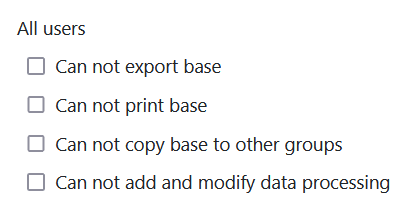
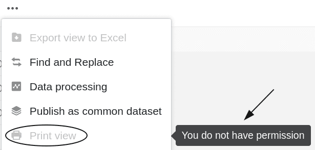
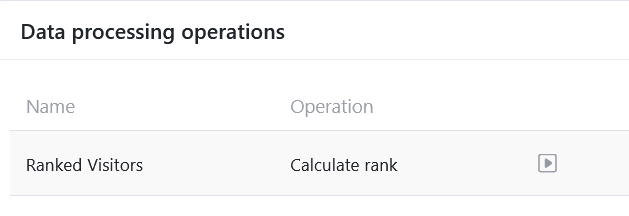
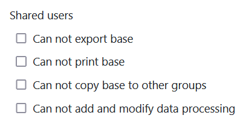

В настройках безопасности вашей базы вы можете в любое время выполнить настройки, которые влияют на безопасность вашей базы и защиту содержащихся в ней данных. Настройки безопасности применяются конкретно к базе в целом и могут отличаться от базы к базе в зависимости от сделанных настроек.



## Редактирование параметров безопасности базы

1. Откройте **базу**, параметры безопасности которой вы хотите изменить.
2. Нажмите на **три точки** в заголовке базы.
3. Перейдите в раздел **"Настройки"**, а затем в раздел " **Настройки безопасности**".
4. В новом окне выполните настройки безопасности для **All users** и **Shared users**.
5. Затем **закройте** окно. Сделанные настройки будут **сохранены** автоматически.

## Настройки безопасности: Все пользователи

Первая часть настроек безопасности относится к полномочиям **всех пользователей**, имеющих доступ к соответствующей базе. В этом разделе можно выполнить следующие настройки:

### Предотвращение экспорта базы

Активировав эту настройку, вы можете **запретить** другим пользователям [экспортировать](#base_exportieren) вашу базу.

Если эта настройка **активирована**, то данная база больше не может быть экспортирована **никем** до тех пор, пока эта настройка не будет снова деактивирована владельцем или администратором. Если пользователь все же попытается экспортировать данную базу через стартовую страницу, экспорт будет **предотвращен** и появится следующее **сообщение об ошибке**:

### Предотвращение печати базы

Активировав этот параметр, вы можете **запретить** другим пользователям [печатать](https://seatable.io/ru/docs/grundlagen-von-ansichten/das-drucken-einer-ansicht/) различные табличные представления вашей базы.

Если эта настройка **активирована**, различные табличные представления затронутой базы больше не могут быть распечатаны **никем** до тех пор, пока настройка не будет снова деактивирована владельцем или администратором. Соответствующая опция печати в опциях представления отображается для всех пользователей **серой** и больше **не** может быть нажата. Кроме того, в **примечании** указывается, что у пользователей **нет** разрешения на печать представлений таблицы.

### Предотвращение копирования базы в другую группу

Активировав этот параметр, вы можете **запретить** другим пользователям [копировать базу в другую группу]().

Если эта настройка **активирована**, то данная база не может быть скопирована **никем** в другую группу или в область " _Мои базы"_ до тех пор, пока настройка не будет снова деактивирована владельцем или администратором. Если пользователь все же попытается скопировать соответствующую базу через стартовую страницу, процесс копирования будет **предотвращен** и появится следующее **сообщение об ошибке**:

### Предотвращение создания и модификации операций по обработке данных

Активизировав эту настройку, можно **запретить** другим пользователям создавать, редактировать или удалять [операции по обработке данных]().

Если эта настройка **активирована**, то соответствующие пиктограммы для добавления, редактирования или удаления операций обработки данных будут **скрыты** до тех пор, пока настройка не будет снова деактивирована владельцем или администратором. Однако все пользователи по-прежнему могут выполнять существующие [операции обработки]() данных.

## Настройки безопасности: Общие пользователи

Вторая часть настроек безопасности относится к полномочиям **пользователей**, которым доступна соответствующая [база](https://seatable.io/ru/docs/freigaben/anlegen-einer-benutzerfreigabe/). В этой части вы можете сделать те **же** настройки, которые уже доступны всем пользователям в первой части:

### Предотвращение экспорта базы

Активизировав этот параметр, можно **запретить** пользователям, которым [предоставлена](#base_exportieren) ее.

### Предотвращение печати базы

Активировав эту настройку, вы можете **запретить** пользователям, для которых [выпущена](https://seatable.io/ru/docs/freigaben/anlegen-einer-benutzerfreigabe/) соответствующая [база](https://seatable.io/ru/docs/freigaben/anlegen-einer-benutzerfreigabe/), [распечатывать](https://seatable.io/ru/docs/grundlagen-von-ansichten/das-drucken-einer-ansicht/) различные табличные представления базы.

### Предотвращение копирования базы в другую группу

Активировав этот параметр, вы можете **запретить** пользователям, для которых [выпущена]() ее в другую группу или в область " _Мои базы"_.

### Предотвращение создания и модификации операций по обработке данных

Активизировав эту настройку, можно **запретить** пользователям, для которых [освобождена]() данных. Однако при этом они могут [выполнять]() существующие [операции]() обработки данных.
