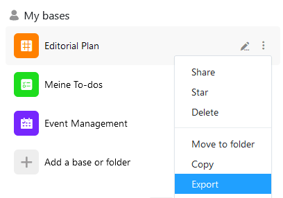

You can export a base as a DTABLE file at any time and thus save a comprehensive backup on your device. You can find out how this works and what you should bear in mind in the following article.

## To export a base

1. Go to the **home** page of SeaTable.
2. Move the mouse cursor to the name of the **base** you want to export and click the **three-dot icon** that appears on the far right.
3. Select the **Export** menu item.

Depending on your browser settings, the **download** will either start automatically or you will be asked where you want to save the export file. If necessary, select a suitable **location** and confirm the selection.

As soon as your file with the extension **.dtable** appears in the specified location, the export of the base is completed.



Be aware that the **DTABLE file** can become very **large** if you have made extensive use of file and image columns in the exported base. Bases with a **maximum size of up to 100 MB** can be exported in the SeaTable Cloud. You can use the [file manager]() to **delete file attachments** in bases that exceed this size limit to enable the export.



## What does a DTABLE file store?

The exported DTABLE file contains the current state of your base, including all the

- Tables and views,
- rowscolumns and values,
- Images and files,
- Web forms,
- Statistics,
- Scripts,
- Plugins and
- Apps.



## Restore a base from a DTABLE file

You can always **import** a DTABLE file back into SeaTable as a new Base. You can learn more about this in the article [Creating a Base from a DTABLE File]().
