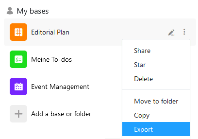

Вы можете в любой момент экспортировать базу в файл DTABLE и таким образом сохранить на своем устройстве полную резервную копию. О том, как это работает и о чем следует помнить, вы узнаете из следующей статьи.

## Чтобы экспортировать базу

1. Перейдите на **домашнюю страницу** SeaTable.
2. Подведите указатель мыши к названию **базы**, которую вы хотите экспортировать, и нажмите на **значок с тремя точками**, который появится в крайнем правом углу.
3. Выберите пункт меню **Экспорт**.

В зависимости от настроек вашего браузера **загрузка** начнется автоматически или вам будет предложено сохранить файл экспорта. При необходимости выберите подходящее **место хранения** и подтвердите выбор.

Как только ваш файл с расширением **.dtable** появится в указанном месте хранения, экспорт базы будет завершен.



## Что хранится в файле DTABLE?

Экспортированный файл DTABLE содержит текущее состояние вашей базы, включая все

- Таблицы и виды,
- Строки, столбцы и значения,
- Изображения и файлы,
- Веб-формы,
- Статистика,
- Сценарии,
- Плагины и
- Приложения.



## Восстановление базы из файла DTABLE

Вы можете в любое время **импортировать** файл DTABLE обратно в SeaTable в качестве новой базы. Подробнее об этом вы можете прочитать в статье [Создание базы из файла DTABLE]().
