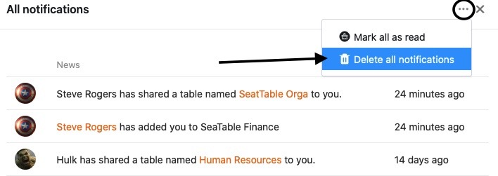

Benachrichtigungen sind ein wichtiger Bestandteil bei der Zusammenarbeit in SeaTable und informieren Sie unter anderem darüber, dass Automationen in Ihren Bases ausgelöst, Kommentare zu einer Zeile hinzugefügt oder Bases mit Ihnen geteilt wurden. Um Ihnen die Übersicht über eingegangene Benachrichtigungen zu erleichtern, können Sie auf diese sowohl von der Startseite aus als auch innerhalb Ihrer Bases zugreifen.

## Alle Benachrichtigungen löschen

Wenn Sie alle Benachrichtigungen zur Kenntnis genommen haben, können Sie diese einfach löschen. Gehen Sie dazu wie folgt vor:

1. Öffnen Sie die **Benachrichtigungszentrale**, indem Sie auf die **Glocke**  am oberen rechten Seitenrand klicken.
2. Klicken Sie auf **Alle Benachrichtigungen anzeigen**.
3. Klicken Sie auf die **drei Punkte** neben dem x-Symbol.
4. Wählen Sie **Alle Benachrichtigungen löschen**.
   

## Alle Benachrichtigungen als gelesen markieren

Benachrichtigungen als gelesen zu markieren kann beispielsweise dann sinnvoll sein, wenn Sie Benachrichtigungen zur Kenntnis genommen haben, aber sie noch nicht löschen möchten.



1. Öffnen Sie die **Benachrichtigungszentrale**, indem Sie auf die **Glocke**  am oberen rechten Seitenrand klicken.
2. Klicken Sie auf **Alle Benachrichtigungen anzeigen**.
3. Klicken Sie auf die **drei Punkte** neben dem x-Symbol.
4. Wählen Sie **Alle als gelesen markieren**.
   

## Zugriff auf die Benachrichtigungen

Sie können sowohl über die **Startseite** von SeaTable als auch innerhalb von **Bases** auf die Benachrichtigungen zugreifen und folglich auf beiden Wegen Ihre Benachrichtigungen als gelesen markieren bzw. löschen. Klicken Sie hierzu einfach auf die **Glocke**  am oberen rechten Seitenrand.

### Zugriff über die Startseite

### Zugriff innerhalb einer Base



Bitte beachten Sie, dass es vom **Inhalt** einer Benachrichtigung abhängig ist, wo genau diese angezeigt wird. Benachrichtigungen zu Freigaben werden Ihnen beispielsweise stets auf der **Startseite** angezeigt, Benachrichtigungen infolge von [Automationen]() oder [Mitarbeiter-Spalten]()\-Einträgen hingegen in der jeweiligen **Base**.


