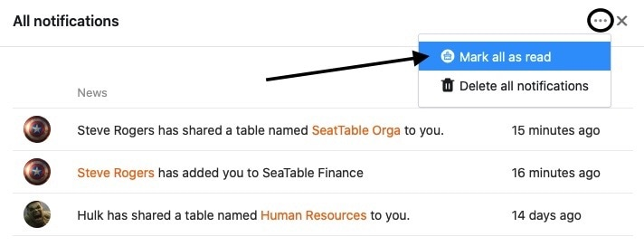

Les notifications sont un élément important de la collaboration dans SeaTable et vous informent, entre autres, que des automatisations ont été déclenchées dans vos Bases, que des commentaires ont été ajoutés à une ligne ou que des Bases ont été partagées avec vous. Pour vous aider à garder une trace des notifications reçues, vous pouvez y accéder à la fois depuis la page d'accueil et au sein de vos bases.

## Supprimer toutes les notifications

Si vous avez pris connaissance de toutes les notifications, vous pouvez les supprimer facilement. Pour ce faire, procédez comme suit :

1. Ouvrez le **centre de notifications** en cliquant sur la **cloche**  en haut à droite de la page.
2. Cliquez sur **Afficher toutes les notifications**.
3. Cliquez sur les **trois points** à côté du symbole x.
4. Sélectionnez **Supprimer toutes les notifications**.

## Marquer toutes les notifications comme lues

Marquer les notifications comme lues peut être utile, par exemple, lorsque vous avez pris connaissance de notifications mais que vous ne souhaitez pas encore les supprimer.



1. Ouvrez le **centre de notifications** en cliquant sur la **cloche**  en haut à droite de la page.
2. Cliquez sur **Afficher toutes les notifications**.
3. Cliquez sur les **trois points** à côté du symbole x.
4. Sélectionnez **Marquer tout comme lu**.

## Accès aux notifications

Vous pouvez accéder aux notifications depuis la **page d'accueil** de SeaTable ou depuis **Bases**, et donc marquer vos notifications comme lues ou les supprimer de l'une ou l'autre manière. Pour cela, il suffit de cliquer sur la **cloche**  en haut à droite de la page.

### Accès via la page d'accueil

### Accès au sein d'une base

{{< warning  headline="Remarque importante"  text="Veuillez noter que l'endroit exact où une notification est affichée dépend de son **contenu**. Par exemple, les notifications concernant les partages sont toujours affichées sur la **page d'accueil**, alors que les notifications concernant les [automatisations](https://seatable.io/fr/docs/benachrichtigungen/benachrichtigungen-per-automation-versenden/), les [commentaires](https://seatable.io/fr/docs/arbeiten-mit-zeilen/die-kommentarfunktion-in-seatable/) ou les [entrées dans les colonnes des collaborateurs](https://seatable.io/fr/docs/datum-dauer-und-personen/die-spalte-mitarbeiter/) sont affichées dans la **base** correspondante." />}}
