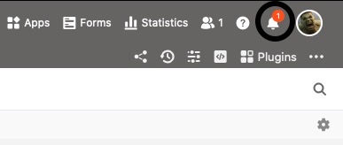
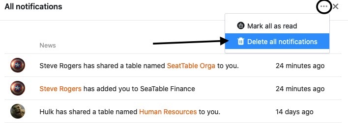
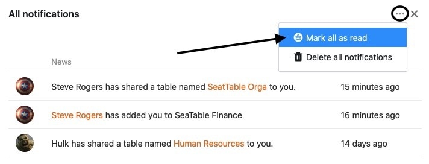
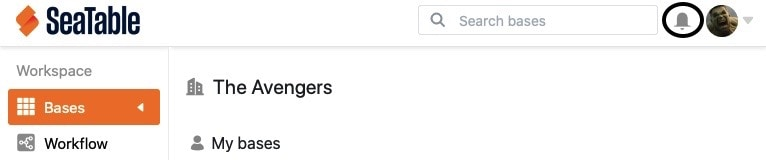

As notificações são uma parte importante da colaboração no SeaTable e informam, entre outras coisas, que foram desencadeadas automatizações nas suas bases, que foram acrescentados comentários a uma fila ou que as bases foram partilhadas consigo. Para o ajudar a acompanhar as notificações recebidas, pode aceder às mesmas a partir da página inicial, bem como a partir das suas bases.

## Eliminar todas as notificações

Se tomou nota de todas as notificações, pode simplesmente apagá-las. Para o fazer, proceda da seguinte forma:

1. Abra o **centro de notificação** clicando na **campainha**  no canto superior direito da página.
2. Clique **Mostrar todas as Notificações**.
3. Clique nos **três pontos** ao lado do símbolo x.
4. Seleccionar **Apagar todas as Notificações**.

## Marcar todas as notificações como lidas

A marcação de notificações como lidas pode ser útil, por exemplo, se tiver tomado nota das notificações mas não as quiser apagar ainda.



1. Abra o **centro de notificação** clicando na **campainha**  no canto superior direito da página.
2. Clique **Mostrar todas as Notificações**.
3. Clique nos **três pontos** ao lado do símbolo x.
4. Seleccione **Marcar tudo como lido**.

## Acesso às notificações

Pode aceder às notificações tanto a partir da página **inicial do** SeaTable como de dentro de **Bases**, e consequentemente marcar as notificações como lidas ou apagá-las de ambas as maneiras. Para o fazer, basta clicar na **campainha**  no canto superior direito da página.

### Acesso através da página inicial

### Acesso dentro de uma base



É favor notar que depende do **conteúdo de** uma notificação, onde é exibida exactamente. Por exemplo, as notificações relativas a lançamentos são sempre exibidas na página **inicial**, enquanto as notificações resultantes de [automatizações]() ou [entradas de colunas de pessoal]() são exibidas na respectiva **base**.


