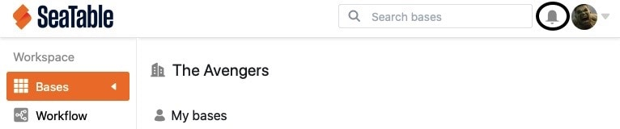

Уведомления являются важной частью совместной работы в SeaTable и информируют вас, среди прочего, о том, что в ваших базах сработали автоматики, комментарии были добавлены к строке или базы были переданы вам. Чтобы помочь вам отслеживать получаемые уведомления, вы можете получить к ним доступ с главной страницы, а также из ваших баз.

## Удалить все уведомления

Если вы приняли к сведению все уведомления, вы можете просто удалить их. Для этого выполните следующие действия:

1. Откройте **центр уведомлений**, нажав на **колокольчик**  в правом верхнем углу страницы.
2. Нажмите **Показать все уведомления**.
3. Нажмите на **три точки** рядом с символом x.
4. Выберите **Удалить все уведомления**.

## Пометить все уведомления как прочитанные

Пометить уведомления как прочитанные может быть полезно, например, если вы приняли уведомления к сведению, но пока не хотите их удалять.



1. Откройте **центр уведомлений**, нажав на **колокольчик**  в правом верхнем углу страницы.
2. Нажмите **Показать все уведомления**.
3. Нажмите на **три точки** рядом с символом x.
4. Выберите **Отметить все как прочитанные**.

## Доступ к уведомлениям

Вы можете получить доступ к уведомлениям как с **главной** страницы SeaTable, так и из **Базы**, и, соответственно, отметить свои уведомления как прочитанные или удалить их в обоих случаях. Для этого просто нажмите на **колокольчик**  в правом верхнем углу страницы.

### Доступ через главную страницу

### Доступ в пределах базы



Обратите внимание, что от **содержания** уведомления зависит, где именно оно будет отображаться. Например, уведомления об утверждениях всегда отображаются на **Начальной странице**, в то время как уведомления, связанные с автоматизацией, комментариями или записями в колонке сотрудников, отображаются в соответствующей **Базе**, а комментарии к приложениям - в соответствующем **Приложении**.


