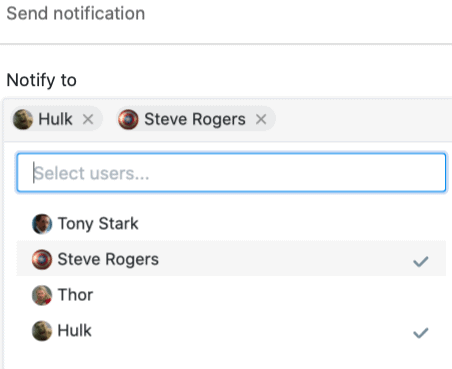
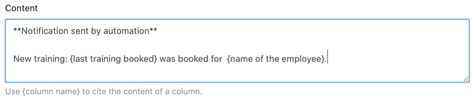



Si vous disposez d'un abonnement Enterprise, vous pouvez également envoyer des notifications par automatisation à des utilisateurs sélectionnés. Pour cela, il suffit de définir une règle d'automatisation correspondante pour une vue de tableau quelconque.

## Envoyer des notifications par automatisation

1. Cliquez sur  dans l'en-tête de base, puis sur **Règles d'automatisation**.
2. Cliquez sur **Ajouter une règle**.
3. Donnez un **nom** à l'automatisation et définissez le **tableau** et la **vue** dans lesquels elle doit agir.
4. Définir un **événement déclencheur** qui déclenchera l'automatisation.
5. Cliquez sur **Ajouter une action** et sélectionnez **Envoyer une notification** comme action automatisée.
6. Confirmez en cliquant sur **Envoyer**.

## Création de l'automation

Définissez d'abord un **événement déclencheur** pour l'automatisation.

Les **quatre options** sont

- Les entrées remplissent certaines conditions après traitement
- Une nouvelle entrée est ajoutée
- Déclencheur périodique
- Déclenchement périodique pour les entrées qui remplissent une certaine condition

Sélectionnez ensuite **Envoyer une notification** comme action automatisée. Celle-ci est disponible comme action pour les quatre options de déclenchement.

  

L'étape suivante consiste à sélectionner les **utilisateurs** qui doivent être informés lorsque l'événement déclencheur se produit. Notez que vous ne pouvez sélectionner ici que les utilisateurs qui ont au moins **un accès en lecture** à la table ou à la vue.

La dernière étape consiste à insérer le **contenu** de la notification dans le **champ de texte** prévu à cet effet. Pour faire référence à des entrées dans le tableau, il suffit d'écrire le nom des colonnes entre accolades dans le texte.

Enregistrez l'automatisation en cliquant sur **Envoyer**.

## Exemple d'application

Une **application** concrète de ce type d'automatisation pourrait par exemple se produire si vous travaillez en tant que cadre dans une entreprise et que vous souhaitez commander la réservation de diverses formations pour vos collaborateurs. Vous souhaitez informer automatiquement le service des ressources humaines, qui se charge de réserver les formations, de la formation que vos collaborateurs souhaitent suivre.

Concrètement, cela peut se faire à l'aide d'un tableau dans lequel sont gérées différentes **données** relatives aux collaborateurs de votre entreprise. Vous pouvez par exemple collecter les **noms** des collaborateurs, le **département** et la dernière formation à laquelle ils se sont inscrits.

Grâce à une automatisation, une **notification** doit être envoyée automatiquement à chaque nouvelle inscription demandée dans le tableau aux collaborateurs sélectionnés du service du personnel afin qu'ils lancent l'inscription à la formation demandée pour le collaborateur concerné.

### Création de l'automation

Tout d'abord, donnez un **nom** à l'automation (par exemple notification if training is booked) et sélectionnez la table (ici : employees & trainings) ainsi que la vue dans laquelle l'automation doit agir.

Comme **événement déclencheur** de l'automatisation, choisissez l'option "Les entrées remplissent certaines conditions après traitement".

Pour que les notifications soient envoyées uniquement en cas de demande d'une nouvelle formation, ajoutez comme **condition de filtrage** que l'entrée de la colonne "last training booked" doit être modifiée en une des **options de sélection** possibles dans cette colonne.

Définissez ensuite l'action "Envoyer une notification" comme action **automatisée**.

L'étape suivante consiste à sélectionner dans le champ déroulant les **collaborateurs** du service du personnel auxquels la **notification** doit être envoyée en cas de déclenchement du trigger.

Dans la dernière étape, vous pouvez écrire le **contenu** de la notification à envoyer dans le champ de texte prévu à cet effet.



### Tester l'automatisation

Si vous demandez ensuite une nouvelle formation pour un employé dans le tableau sélectionné, c'est-à-dire si vous modifiez l'entrée dans la colonne "**last training booked**" pour la dernière formation demandée, la **notification** préétablie sera automatiquement envoyée aux utilisateurs sélectionnés du service du personnel.

Les employés du service des ressources humaines reçoivent l'information qu'une formation a été demandée dans la notification à laquelle ils accèdent via l'icône en forme de cloche  et peuvent lancer la formation sélectionnée pour l'employé concerné.

### Autres exemples intéressants d'automatisation :

- [Verrouiller des lignes par automatisation](https://seatable.io/fr/docs/beispiele-fuer-automationen/zeilen-per-automation-sperren/)
- [Liens vers des entrées par automatisation](https://seatable.io/fr/docs/beispiele-fuer-automationen/verlinken-von-eintraegen-per-automation/)
- [Ajouter des lignes par automatisation](https://seatable.io/fr/docs/beispiel-automationen/zeilen-per-automation-hinzufuegen/)
- [Ajouter des entrées dans d'autres tableaux par automatisation](https://seatable.io/fr/docs/beispiel-automationen/eintraege-in-andere-tabellen-per-automation-hinzufuegen/)
- [Envoi d'e-mails par automatisation](https://seatable.io/fr/docs/beispiel-automationen/e-mail-versand-per-automation/)
