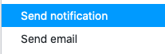
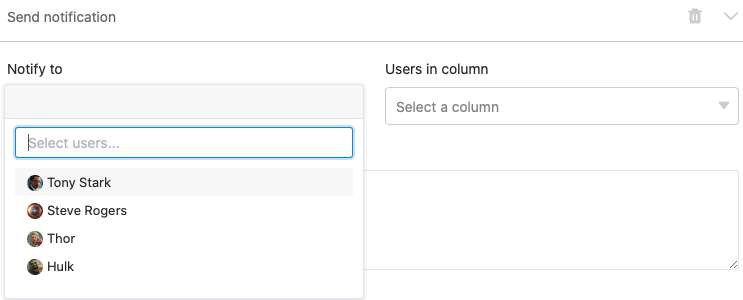
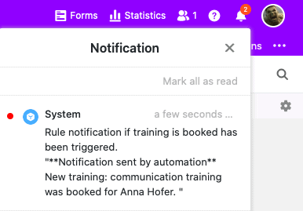



Se tiver uma assinatura Enterprise, também pode enviar notificações a utilizadores seleccionados através de automatização. Basta definir uma regra de automatização correspondente para qualquer visualização de tabela.

## Enviar notificações via automatização

1. Clique em  no cabeçalho da Base e depois nas **Regras de Automatização**.
2. Clique em **Add Rule (Adicionar regra)**.
3. Dar um **nome** à automatização e definir a **tabela** e a **visão em** que deve funcionar.
4. Definir um **evento de disparo que desencadeia** a automatização.
5. Clique em **Adicionar Acção** e seleccione **Enviar Notificação** como acção automatizada.
6. Confirmar com **Submeter**.

## Criar a automatização

Definir primeiro um **evento de disparo** para a automatização.

As **quatro opções** são:

- As inscrições preenchem certas condições após a edição
- É acrescentada uma nova entrada
- Desencadeamento periódico
- Acionador periódico para entradas que preenchem uma determinada condição

Depois seleccionar **Enviar notificação** como a acção automatizada. Isto está disponível como uma acção para as quatro opções de disparo.

  

No passo seguinte, seleccionar os **utilizadores** que devem ser notificados quando o evento de disparo ocorrer. Note que só pode seleccionar utilizadores que tenham pelo menos **acesso lido à** tabela ou à vista.

Na última etapa, inserir o **conteúdo da** notificação no **campo de texto** fornecido. Para se referir às entradas na tabela, basta escrever o nome das colunas entre parênteses rectos no texto.

Guardar a automatização clicando em **Submeter**.

## Exemplo de aplicação

Um **caso** concreto **de utilização** para este tipo de automatização pode ocorrer, por exemplo, se trabalhar como gerente numa empresa e quiser encomendar a marcação de vários cursos de formação para os seus empregados. Gostaria de informar automaticamente o departamento de RH, que em última análise reserva a formação, sobre qual a formação que os seus empregados gostariam de frequentar.

Em termos concretos, isto pode ser implementado com a ajuda de uma tabela na qual são mantidos vários **dados** dos empregados da sua empresa. Neste contexto, poderá recolher, entre outras coisas, os **nomes dos** empregados, o **departamento** e a última formação que reservaram.

Com a ajuda de uma automatização, deve agora ser enviada automaticamente uma **notificação** aos empregados seleccionados no departamento de RH para cada nova reserva solicitada na tabela, para que iniciem a reserva da formação solicitada para o empregado correspondente.

### Criar a automatização

Primeiro, dar um **nome** à automatização (por exemplo, notificação se a formação estiver reservada) e seleccionar tanto a tabela (aqui: empregados & formações) como a vista em que a automatização deve funcionar.

Como **evento desencadeador da** automatização, seleccione a opção "As entradas cumprem determinadas condições após o processamento".

Para que as notificações sejam enviadas apenas em caso de pedido de uma nova formação, adicione como **condição de filtro** que a entrada na coluna "última formação reservada" seja alterada para uma das **opções de seleção** possíveis nesta coluna.

Em seguida, define-se a ação "Enviar notificação" como uma ação **automatizada**.

No passo seguinte, seleccionar no campo pendente os **membros do pessoal** do departamento de RH a quem a **notificação** deve ser enviada quando o gatilho é accionado.

Na última etapa, pode escrever o **conteúdo** da notificação a ser enviada no campo de texto fornecido.



### Teste da automatização

Se, posteriormente, solicitar uma nova formação para um empregado na tabela selecionada, ou seja, se alterar a entrada na coluna**"última formação reservada**" para a última formação solicitada, a **notificação** pré-fabricada é automaticamente enviada para os utilizadores seleccionados do departamento de RH.

Os funcionários do departamento de RH recebem a informação de que foi solicitada uma formação na notificação, a que chegam através do símbolo , e podem iniciar a formação seleccionada para o funcionário correspondente.

### Outros exemplos interessantes de automatização:

- [Linhas de bloqueio por automatização](https://seatable.io/pt/docs/beispiele-fuer-automationen/zeilen-per-automation-sperren/)
- [Ligação de entradas via automatização](https://seatable.io/pt/docs/beispiele-fuer-automationen/verlinken-von-eintraegen-per-automation/)
- [Acrescentar linhas via automatização](https://seatable.io/pt/docs/beispiel-automationen/zeilen-per-automation-hinzufuegen/)
- [Adicionar entradas a outras tabelas através de automatização](https://seatable.io/pt/docs/beispiel-automationen/eintraege-in-andere-tabellen-per-automation-hinzufuegen/)
- [Envio de e-mails por automatização](https://seatable.io/pt/docs/beispiel-automationen/e-mail-versand-per-automation/)
