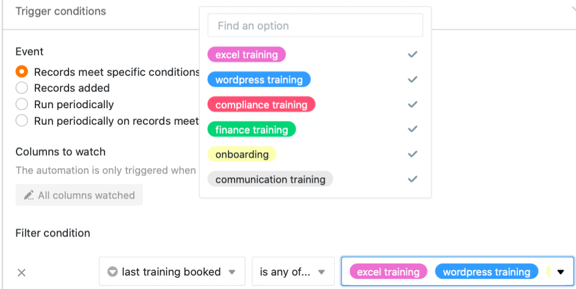



Если у вас есть подписка Enterprise, вы также можете отправлять уведомления выбранным пользователям с помощью автоматизации. Просто определите соответствующее правило автоматизации для любого табличного представления.

## Отправка уведомлений с помощью автоматизации

1. Нажмите на  в заголовке Base, а затем на **Automation Rules**.
2. Нажмите кнопку **Добавить правило**.
3. Дайте автоматизации **имя** и определите **таблицу** и **представление, в** которых она должна работать.
4. Определите **триггерное событие, которое запускает** автоматизацию.
5. Нажмите **Добавить действие** и выберите **Отправить уведомление** в качестве автоматического действия.
6. Подтвердите с помощью кнопки **Отправить**.

## Создание автоматизации

Сначала определите **триггерное событие** для автоматизации.

**Четыре варианта**:

- Записи соответствуют определенным условиям после редактирования
- Добавляется новая запись
- Периодическое срабатывание
- Периодическое срабатывание для записей, выполняющих определенное условие

Затем выберите **Отправить уведомление** в качестве автоматического действия. Это действие доступно для всех четырех вариантов запуска.

  

На следующем шаге выберите **пользователей**, которые должны получать уведомления при наступлении события триггера. Обратите внимание, что вы можете выбрать только тех пользователей, которые имеют как минимум **доступ на чтение к** таблице или представлению.

На последнем этапе вставьте **содержание** уведомления в отведенное **текстовое поле**. Чтобы сослаться на записи в таблице, просто напишите в тексте название столбцов в фигурных скобках.

Сохраните автоматизацию, нажав кнопку **Отправить**.

## Пример применения

Конкретный **пример использования** этого типа автоматизации может иметь место, например, если вы работаете менеджером в компании и хотите заказать бронирование различных учебных курсов для своих сотрудников. Вы хотели бы автоматически информировать отдел кадров, который в конечном итоге бронирует обучение, о том, какие тренинги хотели бы посетить ваши сотрудники.

Конкретно это можно реализовать с помощью таблицы, в которой хранятся различные **данные** о сотрудниках вашей компании. В этом контексте вы можете собрать, среди прочего, **имена** сотрудников, **отдел** и последнее обучение, которое они прошли.

С помощью автоматизации теперь необходимо автоматически отправлять **уведомление** выбранным сотрудникам отдела кадров о каждом новом запрошенном бронировании в таблице, чтобы они инициировали бронирование запрошенного обучения для соответствующего сотрудника.

### Создание автоматизации

Сначала дайте автоматизации **имя** (например, уведомление, если тренинг забронирован) и выберите таблицу (здесь: сотрудники и тренинги) и представление, в котором автоматизация должна работать.

В качестве **триггерного события** автоматизации выберите опцию "Записи выполняют определенные условия после обработки".

Для того чтобы уведомления отправлялись только в случае запроса на новый тренинг, добавьте в качестве **условия фильтрации**, что запись в столбце "последний забронированный тренинг" должна быть изменена на один из возможных **вариантов выбора** в этом столбце.

Затем вы определяете действие "Отправить уведомление" как **автоматическое** действие.

На следующем шаге в выпадающем поле выберите **сотрудников** отдела кадров, которым будет отправлено **уведомление** при срабатывании триггера.

На последнем шаге вы можете написать **содержание** отправляемого уведомления в отведенном текстовом поле.



### Тестирование автоматизации

При последующем запросе нового обучения для сотрудника в выбранной таблице, т.е. изменении записи в колонке**"последнее забронированное обучение**" на последнее запрошенное, сборное **уведомление** автоматически отправляется выбранным пользователям отдела кадров.

Сотрудники отдела кадров получают информацию о том, что был запрошен тренинг, в уведомлении, которое они получают через символ звонка , и могут инициировать выбранный тренинг для соответствующего сотрудника.

### Другие интересные примеры автоматизации:

- [Блокировка линий с помощью автоматики](https://seatable.io/ru/docs/beispiele-fuer-automationen/zeilen-per-automation-sperren/)
- [Связывание записей с помощью автоматизации](https://seatable.io/ru/docs/beispiele-fuer-automationen/verlinken-von-eintraegen-per-automation/)
- [Добавление линий с помощью автоматизации](https://seatable.io/ru/docs/beispiel-automationen/zeilen-per-automation-hinzufuegen/)
- [Добавление записей в другие таблицы с помощью автоматизации](https://seatable.io/ru/docs/beispiel-automationen/eintraege-in-andere-tabellen-per-automation-hinzufuegen/)
- [Отправка по электронной почте с помощью автоматики]()
