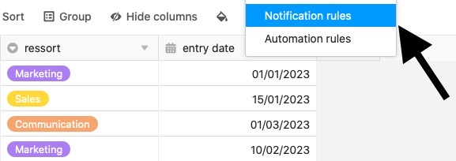

Mithilfe von **Benachrichtigungsregeln** können Sie automatisch Benachrichtigungen an ausgewählte Benutzer versenden, sobald ein im Vorhinein definiertes **Trigger-Ereignis** in einer Ihrer Tabellen eintritt. Benachrichtigungsregeln sind somit grundsätzlich vergleichbar mit [Automationen](), stehen jedoch im Gegensatz zu diesen bereits bei einem Free-Abo zur Verfügung.

## Eine Benachrichtigungsregel erstellen

1. Öffnen Sie eine **Base**, in der Sie eine Benachrichtigungsregel anlegen möchten.
2. Klicken Sie auf  im Base-Header und anschließend auf **Benachrichtigungsregeln**.
3. Klicken Sie auf **Regel hinzufügen**.
4. Erstellen Sie die gewünschte **Benachrichtigungsregel** und bestätigen Sie mit **Abschicken**.

## Einzelne Schritte

Das Anlegen von Benachrichtigungsregeln erfolgt in drei Schritten:

- Basiseinstellungen
- Trigger
- Aktionen

Zunächst nehmen Sie an der neuen Benachrichtigungsregel **Basiseinstellungen** vor. In diesem Schritt geben Sie der Benachrichtigungsregel einen **Namen** und legen fest, in welcher **Tabelle** und in welcher **Ansicht** diese wirken soll.

Im nächsten Schritt definieren Sie ein Ereignis, welches als **Trigger** dient und die Benachrichtigungsregel auslöst. Zur Auswahl stehen die Optionen, dass **Einträge hinzugefügt** oder **verändert** werden oder **nach einer Änderung bestimmte Bedingungen erfüllen**.

Darüber hinaus können Sie als zeitlichen Trigger wählen, dass die **Deadline eines Eintrags naht**. Dieser Trigger ist nur einsetzbar, wenn eine [Datum-Spalte]() in der ausgewählten Tabellenansicht vorliegt. Sie können dann festlegen, **ab wann** und **wie oft** SeaTable **Erinnerungen** verschickt.

Außerdem können Sie je nach Trigger die Anzahl der **überwachten Spalten** eingrenzen und/oder eine **Filter-Bedingung** festlegen, die erfüllt sein muss, damit der Trigger ausgelöst wird.

Abschließend definieren Sie die **Aktion**, die bei Auslösung des Triggers ausgeführt wird. Wählen Sie hierzu zunächst die **Benutzer** aus, denen SeaTable eine Benachrichtigung senden soll. Sie können dabei alle Nutzer auswählen, die **Zugriff** auf die ausgewählte Tabelle haben.

Daneben können Sie – sofern vorhanden – eine Tabellenspalte der Typen _Mitarbeiter_, _Ersteller_ oder _Letzter Bearbeiter_ auswählen, sodass **alle in der Spalte verknüpften Nutzer** eine Benachrichtigung erhalten.



Zu guter Letzt fügen Sie einen **Text** ein, um die Benachrichtigung mit Inhalt zu füllen. Nutzen Sie dabei geschweifte Klammern, um Einträge aus Tabellenspalten zu zitieren.

**Beispiel:** {Spaltenname}

Nach Auslösung des Triggers wird die definierte Benachrichtigung automatisch an die ausgewählten Benutzer versendet. Die Benutzer erkennen am **Glocken-Symbol** , dass eine neue Nachricht in der Benachrichtigungszentrale angekommen ist.



### Weitere hilfreiche Artikel in der Rubrik Benachrichtigungen:

- [Benachrichtigungsregeln bearbeiten und entfernen]()
