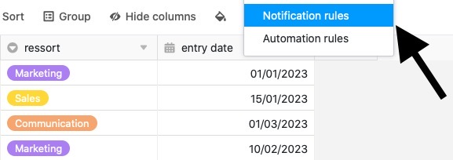
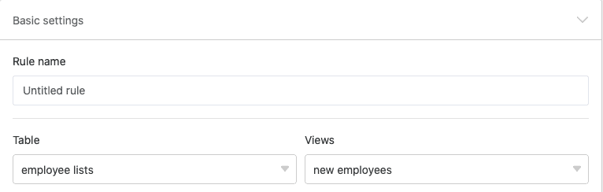
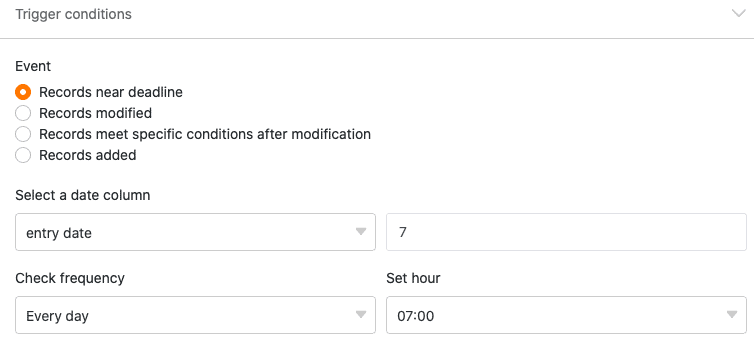
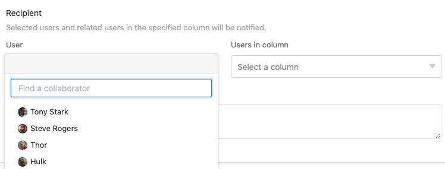
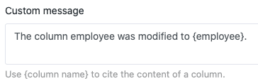
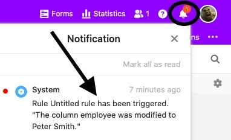

Notification **rules** allow you to automatically send notifications to selected users when a predefined **trigger event** occurs in one of your tables. Notification rules are thus basically similar to [automations](), but unlike them, they are already available with a free subscription.

## Create a notification rule

1. Open a **base** in which you want to create a notification rule.
2. Click  in the base header, and then click **Notification Rules**.
3. Click **Add Rule**.
4. Create the desired **notification rule** and confirm with **Submit**.

## Individual steps

The creation of notification rules is done in three steps:

- Basic settings
- Trigger
- Actions

First, you make **basic settings for** the new notification rule. In this step, you give the notification rule a **name** and specify in which **table** and in which **view** it should take effect.

In the next step, you define an event that serves as a **trigger** and **triggers** the notification rule. You can choose between the options that **entries** are **added** or **changed** or that **certain conditions are met after a change**.

In addition, you can select as a temporal trigger that the **deadline of an entry is approaching**. This trigger is only applicable if there is a [date column]() in the selected table view. You can then specify from **when** and **how often** SeaTable sends **reminders**.

In addition, depending on the trigger, you can limit the number of **monitored columns** and/or set a **filter condition** that must be met for the trigger to fire.

Finally, define the **action** that will be performed when the trigger is triggered. To do this, first select the **users** to whom SeaTable should send a notification. You can select all users who have **access to** the selected table.

Besides, if available, you can select a table column of the types _Employee_, _Creator_ or _Last editor_, so that **all users linked in the column** will receive a notification.



Last but not least, insert **text** to fill the notification with content. Use curly brackets to quote entries from table columns.

**Beispiel:** {Spaltenname}

After the trigger is released, the defined notification is automatically sent to the selected users. The users will recognize by the **bell icon**  that a new message has arrived in the notification center.



### More helpful articles in the notifications section:

- [Edit and remove notification rules]()
