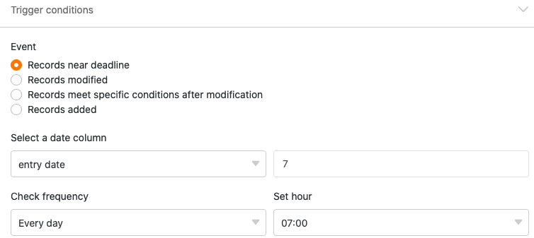
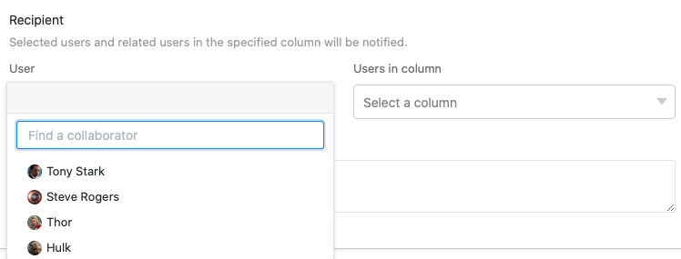

Con la ayuda de las reglas de **notificación**, puede enviar automáticamente notificaciones a los usuarios seleccionados en cuanto se produzca un **evento desencadenante** predefinido en una de sus tablas. Así pues, las reglas de notificación son básicamente comparables a [las automatizaciones](), pero a diferencia de éstas ya están disponibles con una suscripción gratuita.

## Crear una regla de notificación

1. Abra una **Base** en la que desee crear una regla de notificación.
2. Haga clic en  en la cabecera Base y, a continuación, en **Reglas de notificación**.
3. Haga clic en **Añadir Regla**.
4. Cree la **regla de notificación** deseada y confirme con **Enviar**.

## Pasos individuales

La creación de reglas de notificación se realiza en tres pasos:

- Ajustes básicos
- Disparador
- Acciones

En primer lugar se realizan **los ajustes básicos para** la nueva regla de notificación. En este paso se da un **nombre** a la regla de notificación y se determina en qué **tabla** y en qué **vista** debe tener efecto.

En el siguiente paso, se define un evento que sirve de **desencadenante** y **activa** la regla de notificación. Puede elegir entre las opciones de que se **añadan** o **modifiquen** **entradas** o de que se **cumplan determinadas condiciones tras una modificación**.

Además, puede seleccionar como desencadenante temporal que se **acerca la fecha límite de una entrada**. Este disparador sólo puede utilizarse si hay una [columna de fecha]() en la vista de tabla seleccionada. A continuación, puede definir a partir de **cuándo** y **con qué frecuencia** SeaTable envía **recordatorios**.

Además, en función del activador, puede limitar el número de **columnas supervisadas** y/o establecer una **condición de filtro** que deba cumplirse para que se active el activador.

Por último, defina la **acción** que se llevará a cabo cuando se active el disparador. Para ello, seleccione primero los **usuarios** a los que SeaTable debe enviar una notificación. Puede seleccionar todos los usuarios que tengan **acceso a** la tabla seleccionada.

Además, si está disponible, puede seleccionar una columna de la tabla de los tipos _Miembro del personal_, _Creador_ o _Último editor_, para que **todos los usuarios vinculados en la** columna reciban una notificación.



Por último, inserte **texto** para llenar de contenido la notificación. Utilice llaves para citar las entradas de las columnas de la tabla.

**Beispiel:** {Spaltenname}

Tras activar la notificación, la notificación definida se envía automáticamente a los usuarios seleccionados. Los usuarios reconocen por el **símbolo de campana**  que ha llegado un nuevo mensaje al centro de notificaciones.



### Más artículos útiles en la sección Notificaciones:

- [Editar y eliminar reglas de notificación]()
