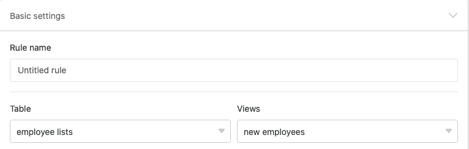
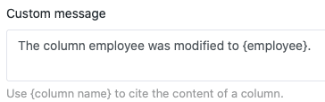

С помощью **правил уведомлений** вы можете автоматически отправлять уведомления выбранным пользователям, как только в одной из ваших таблиц произойдет заранее определенное **триггерное событие**. Таким образом, правила уведомлений в принципе сравнимы с [автоматизациями](), но в отличие от них они доступны уже при бесплатной подписке.

## Создайте правило уведомления

1. Откройте **базу**, в которой вы хотите создать правило уведомления.
2. Нажмите  в заголовке Base, а затем нажмите **Notification Rules**.
3. Нажмите кнопку **Добавить правило**.
4. Создайте нужное **правило уведомления** и подтвердите его нажатием кнопки **Отправить**.

## Отдельные шаги

Создание правил уведомления осуществляется в три этапа:

- Основные настройки
- Триггер
- Действия

Сначала вы выполняете **основные настройки для** нового правила уведомления. На этом шаге вы даете правилу уведомления **имя** и определяете, в какой **таблице** и в каком **представлении** оно будет действовать.

На следующем этапе вы определяете событие, которое служит **триггером** и **запускает** правило уведомления. Вы можете выбрать один из вариантов: **добавление** или **изменение** **записей** или **выполнение определенных условий после изменения**.

Кроме того, в качестве временного триггера можно выбрать **приближение крайнего срока записи**. Этот триггер можно использовать только в том случае, если в выбранном представлении таблицы есть [колонка даты](die-datum-spalte/). Затем вы можете определить, **когда** и **как часто** SeaTable посылает **напоминания**.

Кроме того, в зависимости от триггера, вы можете ограничить количество **отслеживаемых столбцов** и/или определить **условие фильтрации**, которое должно быть выполнено, чтобы триггер сработал.

Наконец, определите **действие**, которое будет выполняться при срабатывании триггера. Для этого сначала выберите **пользователей**, которым SeaTable должен отправить уведомление. Вы можете выбрать всех пользователей, имеющих **доступ к** выбранной таблице.

Кроме того, вы можете - если это возможно - выбрать столбец таблицы типа _Сотрудник_, _Создатель_ или _Последний редактор_, чтобы **все пользователи, связанные с этим столбцом**, получили уведомление.



И последнее, но не менее важное: вставьте **текст**, чтобы заполнить уведомление содержимым. Используйте фигурные скобки для цитирования записей из столбцов таблицы.

**Beispiel:** {Spaltenname}

После запуска уведомления заданное уведомление автоматически отправляется выбранным пользователям. Пользователи узнают по **символу колокольчика** , что в центр уведомлений поступило новое сообщение.



### Больше полезных статей в разделе "Уведомления":

- [Редактирование и удаление правил уведомлений](https://seatable.io/ru/docs/benachrichtigungen/benachrichtigungsregeln-bearbeiten-und-entfernen/)
