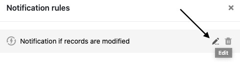
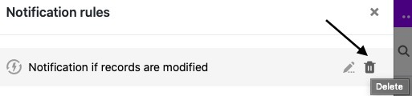

You can **edit** and **delete** notification rules that have already been created at any time. Please note what effects this has on the sending of notifications.

## To edit a notification rule

1. Open the **Base** in which you want to edit an already created notification rule.
2. Click  and then click **Notification Rules**.
3. Hover over the notification rule you want to customize and click the **pencil icon** .
4. Make the desired **adjustments to** the notification rule.
5. Confirm with **Submit**.

## Change options

You can adjust the following settings for a notification rule:

- The **name of** the rule
- The **table** in which the rule acts
- The **view** in which the rule acts
- The **trigger event that triggers** the rule
- The **columns** that SeaTable monitors with a view to the occurrence of the trigger event
- The **filter conditions** that limit the trigger event
- The **users** who receive a notification
- The **content of** the notification

## Effects of machining

After confirming the changes made, they are automatically **saved in** the notification rule and thus **immediately valid**. The selected users will receive the defined notification as soon as the defined trigger is fired.

## To delete a notification rule

1. Open the **Base** in which you want to delete an already created notification rule.
2. Click  and then click **Notification Rules**.
3. Hover the mouse cursor over the notification rule and right-click the **trash icon** .
4. Confirm with **Delete**.



## Effects of deletion

Basically, the trigger event defined for a notification rule will not trigger **any action** after deletion unless it is still acting as a trigger for another notification rule. Consequently, this trigger event will no longer send a **notification** to the selected users.

### More helpful articles in the Notification Rules section:

- [Create notification rule](https://seatable.io/en/docs/benachrichtigungen/benachrichtigungsregel-erstellen/)
