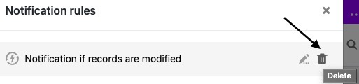

Вы можете **редактировать** и **удалять** уже созданные правила уведомления в любое время. Обратите внимание, как это влияет на отправку уведомлений.

## Чтобы отредактировать правило уведомления

1. Откройте **базу**, в которой вы хотите отредактировать уже созданное правило уведомления.
2. Нажмите на , а затем на **Правила уведомлений**.
3. Наведите курсор на правило уведомления, которое вы хотите настроить, и нажмите на **значок карандаша** .
4. Внесите необходимые **изменения в** правило уведомления.
5. Подтвердите с помощью кнопки **Отправить**.

## Возможности перемен

Вы можете настроить следующие параметры для правила уведомления:

- **Название** правила
- **Таблица**, в которой действует правило
- **Вид, в** котором действует правило
- **Триггерное событие, которое запускает** правило
- **Колонки**, которые SeaTable отслеживает на предмет наступления триггерного события
- **Условия фильтрации**, ограничивающие событие срабатывания
- **Пользователи**, которые получают уведомление
- **Содержание** уведомления

## Эффекты редактирования

После подтверждения внесенных изменений они автоматически **сохраняются в** правиле уведомления и, таким образом, **сразу же становятся действительными**. Выбранные пользователи получают заданное уведомление, как только срабатывает заданный триггер.

## Чтобы удалить правило уведомления

1. Откройте **базу**, в которой вы хотите удалить уже созданное правило уведомления.
2. Нажмите на , а затем на **Правила уведомлений**.
3. Наведите указатель мыши на правило уведомления и щелкните **значок мусорной корзи** ны справа .
4. Подтвердите нажатием кнопки **Удалить**.



## Последствия удаления

В принципе, триггерное событие, определенное для правила уведомления, больше **не будет вызывать действие** после удаления, если только оно не продолжает действовать в качестве триггера для другого правила уведомления. Следовательно, это триггерное событие больше **не** будет отправлять уведомления выбранным пользователям.

### Больше полезных статей в разделе Правила уведомления:

- [Создание правила уведомления](https://seatable.io/ru/docs/benachrichtigungen/benachrichtigungsregel-erstellen/)
