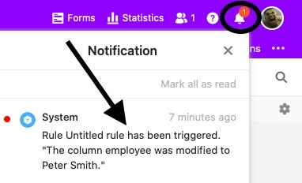

Con la multitud de temas diferentes que llegan a su mesa cada día, puede ocurrir que pierda la visión de conjunto en SeaTable: Se olvida **una cita**, pasa desapercibido el **comentario** de un compañero o se pasa por alto un **cambio** importante.

La **función de notificación** está diseñada para evitar que se pierda algo importante mientras colabora en SeaTable y puede recordarle las citas antes de que se le olviden.

El tema de este artículo es cómo utilizar la función de notificación para realizar un **seguimiento de** sus tareas y actividades en SeaTable.

## Función de notificación

La función de notificación de SeaTable le permite supervisar automáticamente **tablas**, **vistas** o sólo **columnas** individuales. Una vez configurada, garantiza que determinados usuarios reciban una notificación cuando se produzca un evento desencadenante previamente definido.

Con una configuración inteligente y previsora de **las** reglas de notificación, se elimina casi por completo la laboriosa observación personal de una mesa. Puede configurar una regla de notificación para una o varias personas. También puedes hacer que se envíe una notificación que informe a otro u otros usuarios, pero no a ti mismo.



Puedes reconocer la presencia de una **nueva notificación** por el **símbolo de la campana** , que también puedes utilizar para abrir el centro de notificaciones pulsando sobre él.

Tenga en cuenta que una notificación es sólo una **sugerencia dentro de SeaTable**. Una notificación sólo se envía a un usuario por **correo electrónico** si éste lo ha establecido en su configuración personal.
