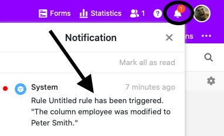

Com a multiplicidade de diferentes tópicos que aterram todos os dias na sua secretária, pode acontecer que perca a visão geral no SeaTable: Um **compromisso** é esquecido, o **feedback** de um colega passa despercebido ou uma **mudança** importante é negligenciada.

A **função de notificação** foi concebida para evitar que lhe falte algo importante enquanto colabora no SeaTable e pode lembrá-lo de compromissos antes que estes sejam esquecidos.

Como utilizar a função de notificação para **acompanhar** as suas tarefas e actividades no SeaTable é o tema deste artigo.

## Função de Notificação

A função de notificação do SeaTable permite-lhe monitorizar automaticamente **tabelas**, **vistas** ou apenas **colunas** individuais. Uma vez configurada, assegura que certos utilizadores são informados por notificação quando ocorre um evento de disparo previamente definido.

Com uma configuração inteligente e prospectiva das **regras de notificação**, a observação pessoal demorada de uma tabela é quase completamente eliminada. Pode-se configurar uma regra de notificação para uma ou mais pessoas. Também pode ser enviada uma notificação que informa um ou mais utilizadores, mas não a si próprio.



Pode reconhecer a presença de uma **nova notificação** pelo **símbolo do sino** , que também pode utilizar para abrir o centro de notificação clicando sobre ele.

É favor notar que uma notificação é apenas uma **dica dentro do SeaTable**. Uma notificação só é enviada a um utilizador por **correio electrónico** se este a tiver definido nas suas configurações pessoais.
