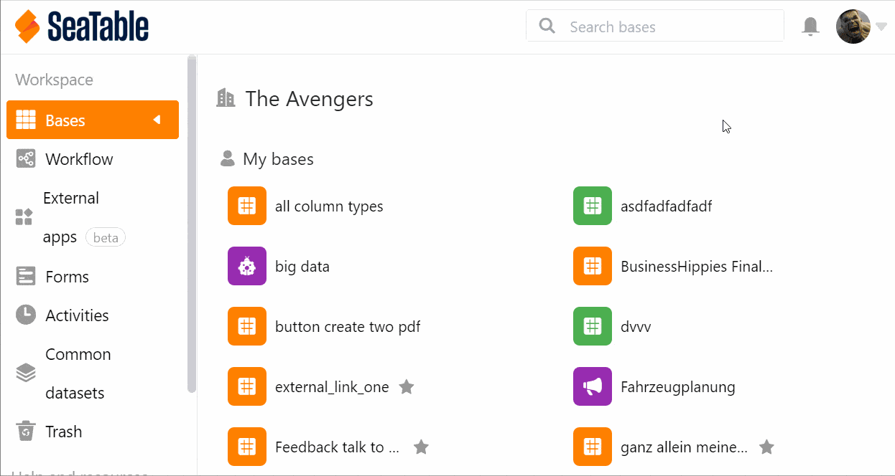

Sie können innerhalb Ihres Teams **Bases mit anderen Benutzern teilen**. Hierbei können Sie zwischen einer **Lesefreigabe** und einer **Lese- und Schreibfreigabe** wählen.

## So erstellen Sie eine Freigabe für einen Benutzer

1. Gehen Sie auf die **Startseite von SeaTable**.
2. Bewegen Sie den Mauszeiger auf die **Base**, die Sie teilen möchten, und klicken Sie auf die rechts erscheinenden **drei Punkte**.
3. Wählen Sie die Option **Freigeben** aus.
4. Gehen Sie auf **Freigabe für Benutzer**.
5. Wählen Sie einen **Benutzer** aus Ihrem Team aus.
6. Stellen Sie ein, ob Sie **Lese- und Schreibrechte** oder nur **Leserechte** vergeben möchten.
7. Klicken Sie auf **Absenden**.

### Freigabe innerhalb der Base

Wenn Sie sich gerade **in einer Base** befinden, können Sie auch eine Freigabe erstellen, ohne auf die Startseite wechseln zu müssen. Klicken Sie dazu auf das **Teilen-Icon**  rechts oben bei den **Base-Optionen**. Das Fenster, das sich zum Erstellen einer Freigabe öffnet, sieht genauso aus wie das auf der Startseite. Befolgen Sie einfach die obige Klickanleitung ab Schritt 4.

## Wie Sie mehrere Personen gleichzeitig hinzufügen

Folgen Sie der obigen Klickanleitung bis zu Schritt 5. Klicken Sie auf das Symbol , um **Personen hinzuzufügen**.

Wählen Sie hier mehrere Benutzer aus, indem Sie die entsprechenden **Häkchen** setzen.

## Die Freigabe einem Benutzer wieder entziehen

Klicken Sie auf das **x-Symbol**, um hinzugefügte Benutzer wieder zu entfernen.

## Berechtigungen der Personen, mit denen Sie eine Base geteilt haben

Ein Benutzer, der von Ihnen eine Freigabe erteilt bekommen hat, ist **kein Eigentümer der Base** und kann beispielsweise **nicht** den Namen der Base ändern.

Bei einer **Lese- und Schreibfreigabe** kann der Benutzer die Inhalte der Base **sehen** und **bearbeiten**. Er kann aber **keine Plugins** installieren und die Base **nicht** mit weiteren Benutzern und Gruppen **teilen**. Etwaige Änderungen an der Base werden bei allen Benutzern mit Zugriff übernommen.

Sollte lediglich eine **Lesefreigabe** vorliegen, kann der Benutzer die Inhalte der Base **nicht bearbeiten**. Er hat aber die **Möglichkeit, eine Kopie der Base anzulegen**, um in der kopierten Tabelle Veränderungen vorzunehmen. Diese sind für die Benutzer mit Zugriff auf die ursprüngliche Base **nicht sichtbar**.
