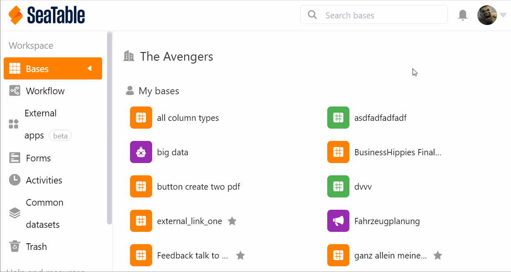
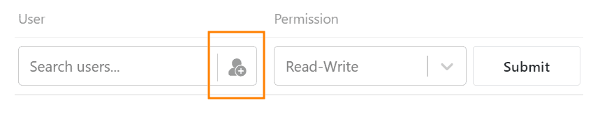
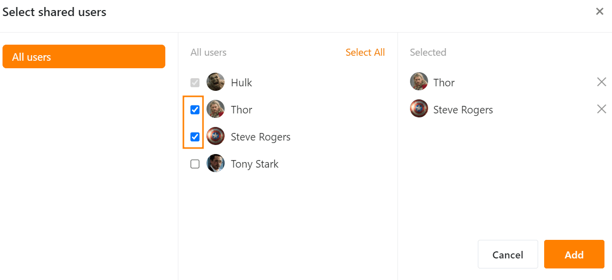
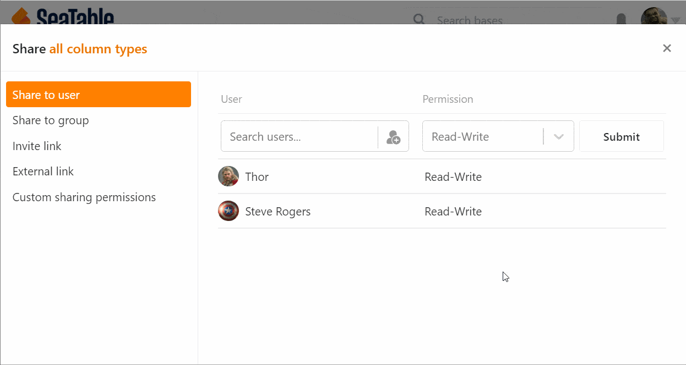

You can **share bases with other users** within your team. Here you can choose between a **read share** and a **read and write share**.

## To create a share for a user

1. Go to the **home page of SeaTable**.
2. Move the mouse cursor to the **base** you want to split and click the **three dots** that appear on the right.
3. Select the **Share** option.
4. Go to **Sharing with Users**.
5. Select a **user** from your team.
6. Set whether you want to assign **read and write perm** issions or **read-only permissions**.
7. Click **Submit**.

### Release within Base

If you are currently **in a Base**, you can also create a share without having to switch to the Home screen. To do this, click the **Share icon**  at the top right of the **Base options**. The window that opens to create a share looks just like the one on the Home page. Just follow the above clicking instructions starting from step 4.

## How to add multiple people at once

Follow the click instructions above to step 5. Click the  icon to **add people**.

Select multiple users here by checking the appropriate **boxes**.

## Withdraw the release from a user again

Click the **x icon** to remove added users.

## Permissions of the people with whom you have shared a base

A user who has been granted a share by you is **not an owner of the base** and **cannot**, for example, change the name of the base.

With a **read and write** share, the user can **see** and **edit** the contents of the Base. However, he **cannot** install **plugins** and **share** the base with other users and groups. Any changes made to the base are applied to all users with access.

If there is only a **read share**, the user cannot **edit** the contents of the Base. However, he has the **possibility to create a copy of the base** in order to make changes in the copied table. These are **not visible** for the users with access to the original Base.
