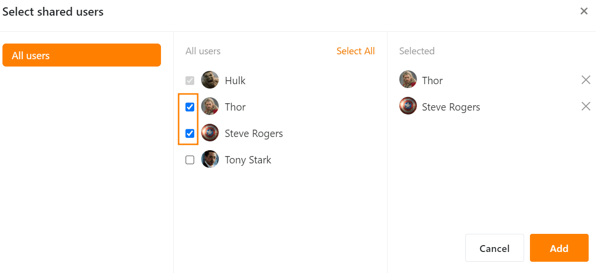
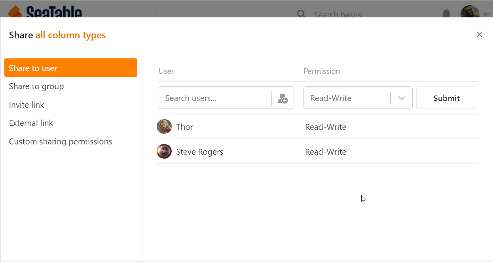

Puedes **compartir bases con otros usuarios** de tu equipo. Puedes elegir entre un uso compartido de **lectura** o un **uso compartido de lectura y escritura**.

## Para crear un recurso compartido para un usuario

1. Vaya a la **página de inicio de SeaTable**.
2. Mueva el puntero del ratón a la **base** que desea dividir y haga clic en los **tres puntos** que aparecen a la derecha.
3. Seleccione la opción **Compartir**.
4. Vaya a **Compartir con usuarios**.
5. Seleccione un **usuario** de su equipo.
6. Establezca si desea asignar **derechos de lectura y escritura** o sólo **de lectura**.
7. Haga clic en **Enviar**.

### Liberación dentro de la base

Si te encuentras **en una** base, también puedes crear una acción sin tener que cambiar a la página de inicio. Para ello, haga clic en el **icono** de compartir  situado en la parte superior derecha de las **opciones de** la base. La ventana que se abre para crear una acción es exactamente igual a la de la página de inicio. Sólo tienes que seguir las instrucciones del paso 4.

## Cómo añadir a varias personas al mismo tiempo

Siga las instrucciones de clic anteriores hasta el paso 5. Haga clic en el icono  para **añadir personas**.

Seleccione aquí varios usuarios colocando las **marcas** correspondientes.

## Retirar de nuevo la autorización a un usuario

Haga clic en el **símbolo x** para eliminar los usuarios añadidos.

## Permisos de las personas con las que has compartido una base

Un usuario al que usted ha concedido una autorización **no es el propietario de** la base y **no puede**, por ejemplo, cambiar el nombre de la base.

Con el **uso compartido de lectura y escritura**, el usuario puede **ver** y **editar** el contenido de la base. Sin embargo, no puede instalar **ningún plug-in** y **no puede** **compartir** la base con otros usuarios y grupos. Cualquier cambio en la base se aplica a todos los usuarios con acceso.

Si sólo existe una **liberación de lectura**, el usuario no puede **editar** el contenido de la base. Sin embargo, tiene la **opción de crear una copia** de la base para realizar cambios en la tabla copiada. Éstos **no son visibles para** los usuarios con acceso a la base original.
