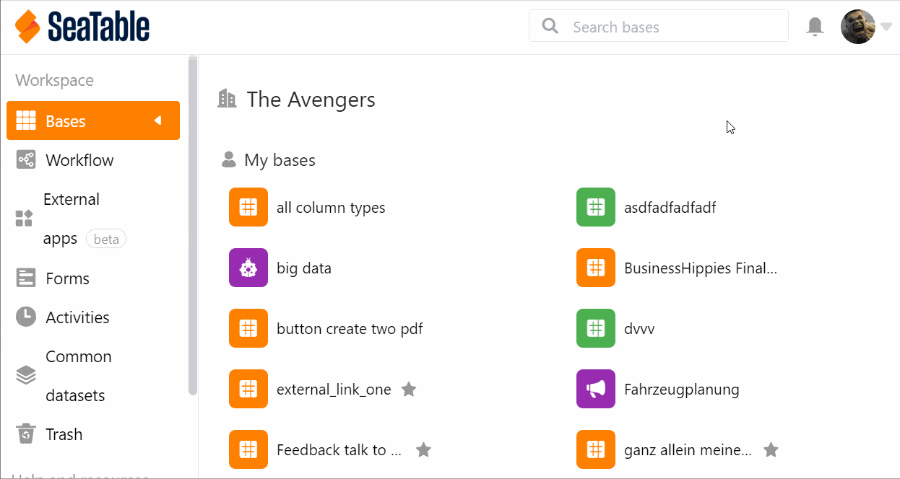
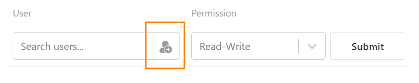
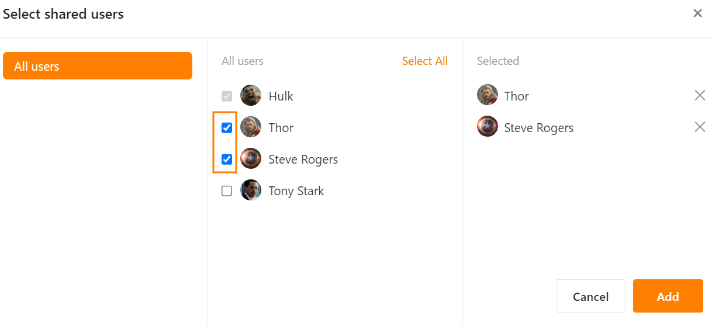
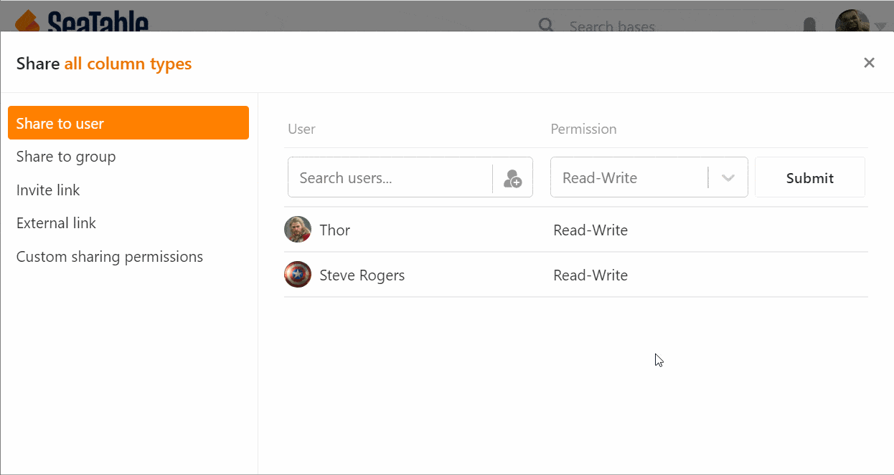

Pode **partilhar bases com outros utilizadores** dentro da sua equipa. Pode escolher entre uma **partilha de leitura** e uma **partilha de leitura e escrita**.

## Como criar uma partilha para um utilizador

1. Vá para a **página inicial do SeaTable**.
2. Mova o ponteiro do rato para a **base** que pretende partilhar e clique nos **três pontos** que aparecem à direita.
3. Selecione a opção **Partilhar**.
4. Vá para **Partilhar com utilizadores**.
5. Selecione um **utilizador** da sua equipa.
6. Defina se pretende atribuir **direitos de leitura e escrita** ou apenas **direitos de leitura**.
7. Clique em **Submeter**.

### Partilha dentro da base

Se estiver atualmente **numa base**, também pode criar uma partilha sem ter de mudar para a página inicial. Para o fazer, clique no **ícone de partilha**  no canto superior direito das **opções da base**. A janela que se abre para criar uma partilha é exatamente igual à da página inicial. Basta seguir as instruções acima, a partir do passo 4.

## Como adicionar várias pessoas ao mesmo tempo

Siga as instruções de clique acima até ao passo 5. Clique no ícone  para **adicionar pessoas**.

Selecione aqui vários utilizadores, colocando os **vistos** correspondentes.

## Retirar novamente a partilha a um utilizador

Clique no **símbolo x** para remover utilizadores adicionados.

## Permissões das pessoas com as quais partilhou uma base

Um utilizador a quem tenha concedido uma partilha **não** é **o proprietário da base** e **não pode**, por exemplo, alterar o nome da base.

Com a **partilha de leitura e escrita**, o utilizador pode **ver** e **editar** o conteúdo da base. No entanto, não pode instalar **quaisquer plug-ins** nem **partilhar** a base com outros utilizadores e grupos. Quaisquer alterações à base são aplicadas a todos os utilizadores com acesso.

Se houver apenas uma **partilha de leitura**, o utilizador não pode **editar** o conteúdo da base. No entanto, tem a **opção de criar uma cópia da base**, a fim de fazer alterações na tabela copiada. Estas **não** são **visíveis** para os utilizadores com acesso à base original.
