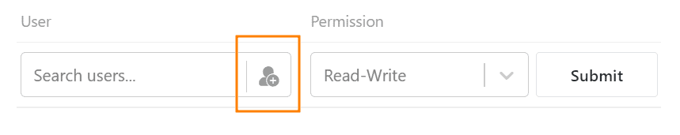

Pode **partilhar bases com outros utilizadores** dentro da sua equipa. Pode escolher entre uma **partilha de leitura** e uma **partilha de leitura e escrita**.

## Para criar uma acção para um utilizador

1. Ir para a **página inicial do SeaTable**.
2. Mova o ponteiro do rato para a **base** que pretende dividir e clique nos **três pontos** que aparecem do lado direito.
3. Seleccionar a opção **Partilhar**.
4. Ir para **Partilha com Utilizadores**.
5. Seleccione um **utilizador** da sua equipa.
6. Definir se pretende atribuir **direitos de leitura e escrita** ou apenas **direitos de leitura**.
7. Clique em **Submeter**.

### Lançamento dentro da base

Se estiver actualmente **numa base**, também pode criar uma acção sem ter de mudar para a página inicial. Para o fazer, clique no **ícone de partilha**  no canto superior direito das **opções da base**. A janela que se abre para criar uma acção parece-se exactamente com a da página inicial. Basta seguir as instruções de clique acima, a partir do passo 4.

## Como adicionar várias pessoas ao mesmo tempo

Siga as instruções de clique acima para o passo 5. Clique no ícone  para **adicionar pessoas**.

Seleccione aqui vários utilizadores, colocando as **carraças** apropriadas.

## Retirar novamente a libertação de um utilizador

Clique no **símbolo x** para remover utilizadores adicionados.

## Permissões das pessoas com as quais partilhou uma base

Um utilizador a quem tenha sido concedida uma autorização pelo utilizador **não** é **o proprietário da base** e **não pode**, por exemplo, alterar o nome da base.

Com a **partilha da leitura e da escrita**, o utilizador pode **ver** e **editar** o conteúdo da base. No entanto, não podem instalar **quaisquer plug-ins** e **não podem** **partilhar** a base com outros utilizadores e grupos. Quaisquer alterações à base são aplicadas a todos os utilizadores com acesso.

Se houver apenas uma **versão lida**, o utilizador não pode **editar** o conteúdo da base. No entanto, ele tem a **opção de criar uma cópia da base**, a fim de fazer alterações na tabela copiada. Estas **não** são **visíveis para os** utilizadores com acesso à base original.
