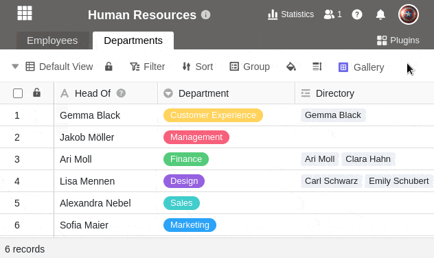



Eine benutzerdefinierte Freigabeberechtigung ermöglicht es Ihnen, **mehrere Tabellen und Ansichten** aus einer Base gleichzeitig freizugeben. Dies erspart Ihnen viel Arbeit, wenn Sie mit Ihren Teammitgliedern zahlreiche Tabellen und Ansichten, aber keine ganze Base teilen wollen.

Trotz dieser gebündelten Freigabe können Sie detailliert die gewünschte **Berechtigung** definieren, da Sie für jede Tabelle und Ansicht einzeln auswählen können, ob eine **Lese- und Schreibfreigabe** oder nur eine **Lesefreigabe** erteilt werden soll.

So können Sie beispielsweise festlegen, dass Sie auf die erste Tabelle einer Base Lese- und Schreibzugriff gewähren, auf die zweite Tabelle nur Leserechte und auf alle weiteren Tabellen gar keinen Zugriff.

Nachdem Sie eine benutzerdefinierte Freigabe erstellt haben, können Sie diese an **einzelne Teammitglieder** oder **ganze Gruppen** versenden.

## So erstellen Sie eine benutzerdefinierte Freigabeberechtigung

Ihnen stehen **zwei** Wege zur Verfügung, um einzelne Tabellen und Ansichten einer Base freizugeben:

- Von der **Startseite** aus
- Über das **Teilen-Icon** in der Base

### Von der Startseite aus

1. Gehen Sie auf die **Startseite von SeaTable**.
2. Bewegen Sie den Mauszeiger auf die Base, die Sie teilen möchten, und klicken Sie auf die rechts erscheinenden **drei Punkte**.
3. Klicken Sie auf **Freigeben**.
4. Wählen Sie den Menüpunkt **Benutzerdefinierte Freigabeberechtigung** aus.
5. Klicken Sie auf **Berechtigung hinzufügen**.
6. Geben Sie der Berechtigung einen **Namen** und fügen Sie eine **Beschreibung** hinzu.
7. Setzen Sie **Häkchen** bei den einzelnen Tabellen und Ansichten, die Sie teilen wollen, und entscheiden Sie dabei, ob Sie **Lese- und Schreibrechte** oder nur **Leserechte** vergeben möchten.

### Über das Teilen-Icon in der Base

1. Öffnen Sie die **Base**, von der Sie einzelne Tabellen oder Ansichten freigeben möchten.
2. Klicken Sie oben rechts in den **Base-Optionen** auf **Teilen** .
3. Im Anschluss öffnet sich das gleiche **Freigabe-Fenster** wie beim ersten Weg. Folgen Sie der obigen **Klickanleitung** ab Schritt 4, um die Freigabe anzulegen.

## Die Freigabe an Benutzer oder Gruppen senden

Die erstellte Freigabeberechtigung steht Ihnen nun unter **Freigabe für Benutzer** oder **Freigabe für Gruppe** bei den Berechtigungen als Option zur Auswahl. Um die benutzerdefinierte Freigabe zu verschicken, gehen Sie wie folgt vor:

1. Klicken Sie in der linken Spalte des Freigabe-Fensters auf **Freigabe für Gruppe** oder **Freigabe für Benutzer**.
2. Wählen Sie die **Gruppe** oder die **Benutzer** aus, denen Sie die benutzerdefinierte Freigabe senden möchten.
3. Im Feld **Rechte** können Sie nun die zuvor erstellte **Freigabeberechtigung** unter dem jeweiligen Namen auswählen.
4. Bestätigen Sie die Freigabe mit **Absenden**.

Ausführliche Erläuterungen, was Sie bei Freigaben an Benutzer oder Gruppen beachten sollten, erhalten Sie in den folgenden Artikeln:

- [Eine Base an einen Benutzer freigeben](https://seatable.io/docs/freigabelinks/anlegen-einer-benutzerfreigabe/)
- [Eine Base an eine Gruppe freigeben](https://seatable.io/docs/freigabelinks/freigabe-einer-base-an-eine-gruppe/)

## Folgen der Freigabe

Geteilte Tabellen und Ansichten findet man im **Arbeitsbereich** der Gruppe oder des Benutzers auf der **Startseite**. Diese werden immer mit dem Hinweis **Freigegeben** angezeigt.

Tabellen und Ansichten, die ausschließlich zum **Lesen** freigegeben sind, können Sie folglich **nur** sehen und **nicht** bearbeiten. Wenn Sie in der Tabelle herumklicken, passiert nichts:

Tabellen und Ansichten, die zum **Lesen und Schreiben** freigegeben sind, können Sie hingegen sowohl ansehen als auch **bearbeiten**. Ihre Änderungen sind für alle Benutzer mit Zugriff auf die Tabelle sichtbar:



## Benutzerdefinierte Freigabeberechtigungen bearbeiten

Sie können benutzerdefinierte Freigabeberechtigungen im Nachhinein ändern, indem Sie einzelne **Tabellen und Ansichten** wieder aus der Freigabe **entfernen** oder die **Art der Freigabe anpassen**.

1. Klicken Sie auf **Benutzerdefinierte Freigabeberechtigungen** und fahren Sie mit der Maus über die **Berechtigung**, die Sie anpassen möchten.
2. Klicken Sie auf das erscheinende **Stift-Symbol** .
3. Nun können Sie den **Namen** und die **Beschreibung** der Berechtigung ändern.
4. Darunter haben Sie die Möglichkeit, gesetzte Häkchen für einzelne **Tabellen** und **Ansichten** der Base wieder zu entfernen oder anzupassen, ob diese zum **Lesen und Schreiben** oder nur zum **Lesen** freigegeben werden sollen.
5. Bestätigen Sie mit **Absenden**, um die **Freigabeberechtigung** zu speichern.

## Limitationen

- Sie können Tabellen und Ansichten **ausschließlich** an Gruppen freigeben, in denen Sie bereits **Mitglied** sind.
- Tabellen und Ansichten von Bases, die Sie **selbst erstellt** haben, können Sie jederzeit freigeben, während Tabellen und Ansichten von Bases, die zu einer Gruppe gehören, nur von den **Eigentümern** und **Administratoren** an andere Gruppen oder Benutzer freigegeben werden können.

## Häufige Fragen

 Wann ist eine benutzerdefinierte Freigabe sinnvoll?

|||

In SeaTable sollten Sie zusammengehörige Datensätze grundsätzlich in derselben Base erfassen. Wenn Sie nun nur **einen Teil der Daten** an jemanden **freigeben** wollen, dann sind benutzerdefinierte Freigaben das Mittel der Wahl.

---

Kann man eine benutzerdefinierte Freigabe auch über einen Link teilen?

|||

**Nein**, benutzerdefinierte Freigaben können Sie aktuell nur an ein **Teammitglied** oder eine **Gruppe** senden.


