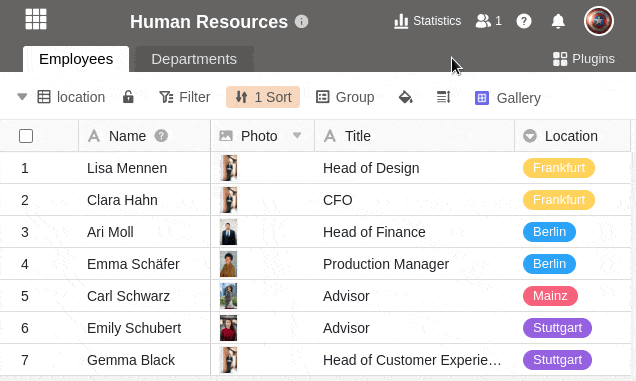



A custom share permission allows you to share **multiple tables and views** from a Base at the same time. This saves you a lot of work if you want to share numerous tables and views with your team members, but not an entire base.

Despite this bundled sharing, you can define the desired **permission** in detail, as you can select individually for each table and view whether a **read and write** share or only a **read share** should be granted.

For example, you can specify that you grant read and write access to the first table of a base, read-only access to the second table, and no access at all to any other tables.

After you create a custom share, you can send it to **individual team members** or **entire groups**.

## To create a custom share permission

You have **two** ways to share individual tables and views of a Base:

- From the **home** page
- Via the **Share icon** in Base

### From the home page

1. Go to the **home page of SeaTable**.
2. Move the mouse cursor to the base you want to split and click the **three dots** that appear on the right.
3. Click **Share**.
4. Select the **Custom share permission** menu item.
5. Click **Add Permission**.
6. Give the permission a **name** and add a **description**.
7. Place **check marks** next to each table and view you want to share, deciding whether you want to assign **read and write** permissions or **read-only perm** issions.

### Via the Share icon in Base

1. Open the **base** from which you want to share individual tables or views.
2. In the top right corner of the **Base options**, click **Share** .
3. Afterwards the same **share window** opens as in the first way. Follow the **click instructions** above from step 4 to create the share.

## Send the share to users or groups

The created share permission is now available as an option under **Share for User** or **Share for Group** in the Permissions. To send the custom share, proceed as follows:

1. In the left column of the Share window, click **Share for Group** or **Share for User**.
2. Select the **group** or **users** you want to send the custom share to.
3. In the **Permissions** field, you can now select the previously created **share permission** under the respective name.
4. Confirm the release with **Submit**.

For detailed explanations of what you should consider when sharing with users or groups, see the following articles:

- [Release a base to a user](https://seatable.io/en/docs/freigabelinks/anlegen-einer-benutzerfreigabe/)
- [Release a base to a group](https://seatable.io/en/docs/freigabelinks/freigabe-einer-base-an-eine-gruppe/)

## Consequences of the release

Shared tables and views can be found in the group's or user's **workspace** on the **home** **page**. They are always displayed with the note **Shared**.

Tables and views that are shared for **reading** only can consequently **only** be seen and **not** edited. If you click around in the table, nothing happens:

Tables and views that are shared for **reading and writing**, on the other hand, you can both view and **edit**. Your changes are visible to all users with access to the table:



## Edit custom share permissions

You can change custom share permissions after the fact by **removing** individual **tables and views** from the share again or **adjusting** the **type of share**.

1. Click **Custom Share Permissions** and hover over the **permission** you want to customize.
2. Click on the **pencil icon that** appears .
3. Now you can change the **name** and **description of** the permission.
4. Below you have the possibility to remove the checkmarks for individual **tables** and **views of** the base or to adjust whether they should be released for **reading and writing** or only for **reading**.
5. Confirm with **Submit** to save the **release authorization**.

## Limitations

- You can share tables and views **only** with groups you are already a **member of**.
- You can share tables and views of bases you **created yourself** at any time, while tables and views of bases belonging to a group can be shared with other groups or users only by the **owners** and **administrators**.

## Frequently asked questions

In SeaTable you should always enter related records in the same base. Now, if you want to **share** only **a part of the data** with someone, custom shares are the way to go.

**No**, you can currently only send custom shares to a **team member** or **group**.


