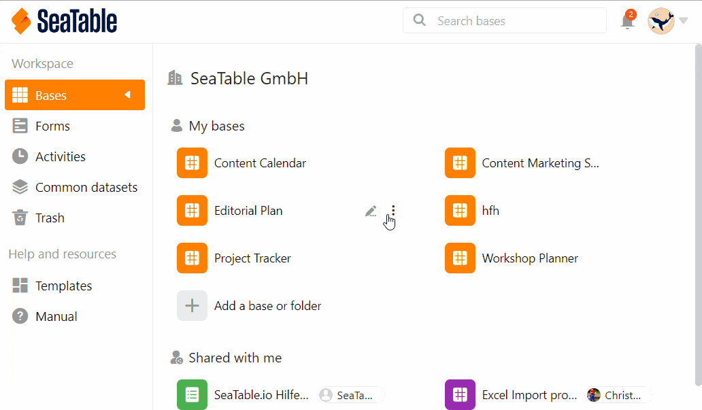



Un permiso de uso compartido personalizado le permite compartir **varias** tablas y vistas de una base al mismo tiempo. Esto le ahorra mucho trabajo si desea compartir numerosas tablas y vistas con los miembros de su equipo, pero no una base entera.

A pesar de esta liberación agrupada, puede definir la **autorización** deseada en detalle, ya que puede seleccionar individualmente para cada tabla y vista si se debe conceder una liberación de **lectura y escritura** o sólo **de lectura**.

Por ejemplo, puede especificar que concede acceso de lectura y escritura a la primera tabla de una base, acceso de sólo lectura a la segunda tabla y ningún acceso a todas las demás tablas.

Una vez creada una acción personalizada, puede enviarla a **miembros individuales del equipo** o a **grupos enteros**.

## Para crear un permiso de uso compartido personalizado

Hay **dos** formas de liberar tablas y vistas individuales de una base:

- En la página de **inicio**
- A través del **icono de compartir** en Base

### En la página de inicio

1. Vaya a la **página de inicio de SeaTable**.
2. Mueva el puntero del ratón a la base que desea dividir y haga clic en los **tres puntos** que aparecen a la derecha.
3. Haga clic en **Liberar**.
4. Seleccione la opción de menú **Permisos compartidos personalizados**.
5. Haga clic en **Añadir permiso**.
6. Asigne un **nombre** al permiso y añada una **descripción**.
7. Coloque **marcas de verificación** junto a las tablas y vistas individuales que desea compartir, decidiendo si desea asignar permisos de **lectura y escritura** o **permisos de sólo lectura**.

### A través del icono de compartir en Base

1. Abra la **base** desde la que desea compartir tablas o vistas individuales.
2. En la esquina superior derecha de las **opciones de la Base**, haga clic en **Compartir** .
3. Se abre la misma **ventana** de compartición que para la primera forma. Siga las **instrucciones** del paso 4 para crear el recurso compartido.

## Enviar la acción a usuarios o grupos

La autorización de publicación creada está ahora disponible para su selección como opción en **Publicación para usuario** o **Publicación para grupo** en las autorizaciones. Para enviar la acción personalizada, proceda del siguiente modo:

1. En la columna izquierda de la ventana Compartir, haga clic en **Compartir para grupo** o **Compartir para usuario**.
2. Seleccione el **grupo** o los **usuarios** a los que desea enviar la acción personalizada.
3. En el campo **Derechos**, ahora puede seleccionar la **autorización de liberación** creada previamente con el nombre correspondiente.
4. Confirme la liberación con **Enviar**.

En los siguientes artículos encontrará explicaciones detalladas sobre lo que debe tener en cuenta a la hora de compartir con usuarios o grupos:

- [Liberar una base a un usuario](https://seatable.io/es/docs/freigabelinks/anlegen-einer-benutzerfreigabe/)
- [Liberar una base a un grupo](https://seatable.io/es/docs/freigabelinks/freigabe-einer-base-an-eine-gruppe/)

## Consecuencias de la liberación

Las tablas y vistas compartidas se encuentran en el **área de trabajo** del grupo o usuario en la página de **inicio**. Estas se muestran siempre con la nota **Compartidas**.

En consecuencia, las tablas y vistas que se liberan exclusivamente para **lectura** **sólo** pueden verse y **no** editarse. Si haces clic en la tabla, no ocurre nada:

En cambio, las tablas y vistas que se liberan para **lectura y escritura** pueden visualizarse y **editarse**. Sus cambios son visibles para todos los usuarios con acceso a la tabla:



## Editar permisos de uso compartido personalizados

Puede cambiar los permisos de compartición personalizados a posteriori **eliminando** **tablas y vistas** individuales de la compartición de nuevo o **ajustando** el **tipo de compartición**.

1. Haga clic en **Permisos compartidos personalizados** y pase el ratón sobre el **permiso** que desee personalizar.
2. Haga clic en el **icono del lápiz que** aparece .
3. Ahora puede cambiar el **nombre** y la **descripción** del permiso.
4. Debajo de esto, tiene la opción de eliminar las marcas de verificación establecidas para las **tablas** y **vistas individuales de** la base de nuevo o ajustar si éstas deben ser liberadas para **lectura y escritura** o sólo para **lectura**.
5. Confirme con **Enviar** para guardar la **autorización de liberación**.

## Limitaciones

- **Sólo** puede compartir tablas y vistas con grupos de los que ya sea **miembro**.
- Puedes compartir tablas y vistas de bases que hayas **creado tú mismo** en cualquier momento, mientras que las tablas y vistas de bases que pertenecen a un grupo sólo pueden ser compartidas con otros grupos o usuarios por los **propietarios** y **administradores**.

## Preguntas frecuentes

En SeaTable, siempre debe introducir conjuntos de datos relacionados en la misma base. Si desea **compartir** con alguien sólo **una parte** de los datos, lo más adecuado son los recursos compartidos definidos por el usuario.

**No**, actualmente sólo puedes enviar acciones personalizadas a un **miembro del equipo** o a un **grupo**.


