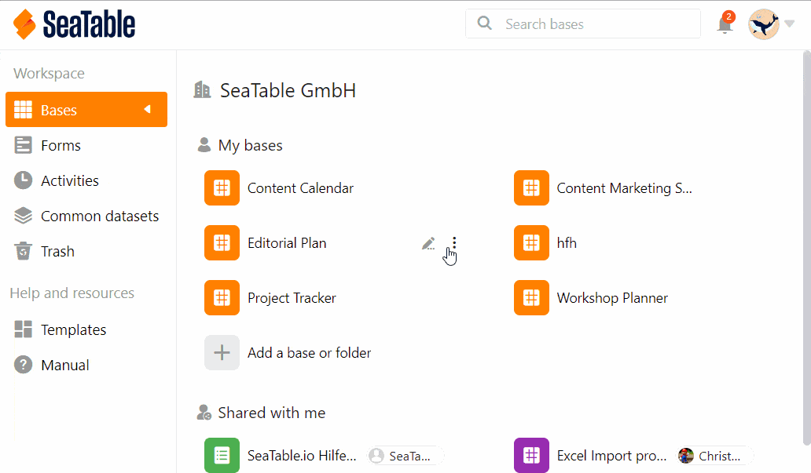
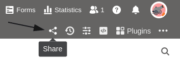
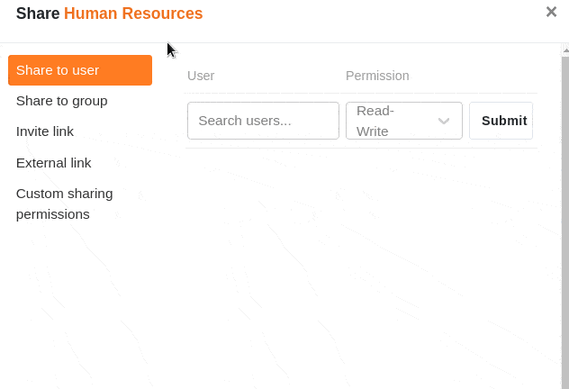
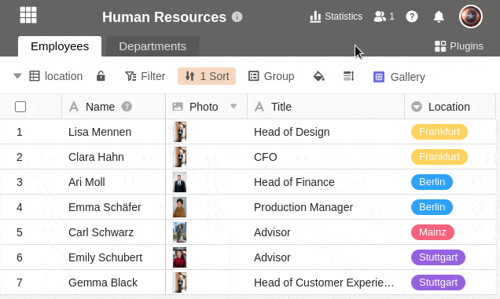
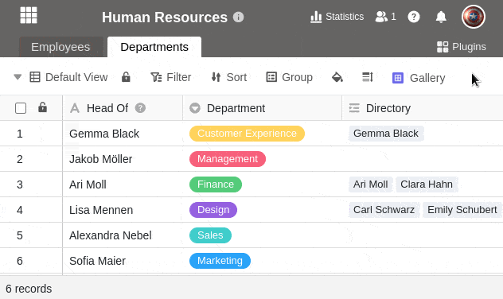



Uma permissão de partilha personalizada permite-lhe partilhar **múltiplas tabelas e vistas** a partir de uma base ao mesmo tempo. Isto poupa-lhe muito trabalho se quiser partilhar numerosas tabelas e vistas com os membros da sua equipa, mas não uma base inteira.

Apesar desta publicação agrupada, pode definir em pormenor a **autorização** desejada, uma vez que pode seleccionar individualmente para cada tabela e ver se uma publicação **lida e escrita** ou apenas uma **publicação lida** deve ser concedida.

Por exemplo, pode especificar que concede acesso de leitura e escrita à primeira tabela de uma base, acesso apenas de leitura à segunda tabela e nenhum acesso a todas as outras tabelas.

Depois de ter criado uma partilha personalizada, pode enviá-la a **membros individuais da equipa** ou a **grupos inteiros**.

## Para criar uma permissão de partilha personalizada

Há **duas** formas de libertar tabelas individuais e vistas de uma base:

- A partir da página **inicial**
- Através do **ícone de acção** na Base

### A partir da página inicial

1. Ir para a **página inicial do SeaTable**.
2. Mova o ponteiro do rato para a base que pretende dividir e clique nos **três pontos** que aparecem do lado direito.
3. Clique em **Release**.
4. Seleccionar o item do menu **Permissão de Partilha Personalizada**.
5. Clique em **Add Permission (Adicionar permissão**).
6. Dar à permissão um **nome** e acrescentar uma **descrição**.
7. Coloque **marcas** ao lado das tabelas e vistas individuais que pretende partilhar, decidindo se pretende atribuir permissões de **leitura e escrita** ou **permissões só de leitura**.

### Através do ícone de acção na Base

1. Abra a **base** a partir da qual deseja partilhar tabelas ou pontos de vista individuais.
2. No canto superior direito das **opções da Base**, clique em **Share** .
3. Abre-se a mesma **janela de partilha** que para a primeira via. Siga as **instruções de clique** acima do passo 4 para criar a partilha.

## Enviar a quota a utilizadores ou grupos

A autorização de liberação criada está agora disponível para selecção em **Release for user** ou **Release for group** nas autorizações. Para enviar a acção personalizada, proceder como se segue:

1. Na coluna da esquerda da janela Partilhar, clique em **Partilhar para Grupo** ou **Partilhar para Utilizador**.
2. Seleccione o **grupo** ou **utilizadores** para os quais pretende enviar a partilha personalizada.
3. No campo **Direitos**, pode agora seleccionar a **autorização de libertação** previamente criada com o respectivo nome.
4. Confirmar a libertação com **Submeter**.

Explicações detalhadas sobre o que deve considerar ao partilhar com utilizadores ou grupos podem ser encontradas nos artigos seguintes:

- [Lançamento de uma Base a um Utilizador]()
- [Libertar uma Base para um Grupo](https://seatable.io/pt/docs/freigabelinks/freigabe-einer-base-an-eine-gruppe/)

## Consequências da libertação

As tabelas e opiniões partilhadas podem ser encontradas no **espaço de trabalho do** grupo ou utilizador na página **inicial**. Estas são sempre exibidas com a nota **Partilhada**.

As tabelas e vistas que são divulgadas exclusivamente para **leitura** **só** podem, consequentemente, ser vistas e **não** editadas. Se clicar na tabela, nada acontece:

As tabelas e vistas que são divulgadas para **leitura e escrita**, por outro lado, podem ser ambas visualizadas e **editadas**. As suas alterações são visíveis para todos os utilizadores com acesso à tabela:



## Editar permissões de partilha personalizadas

Pode alterar retrospectivamente as permissões de partilha personalizadas, **removendo** de novo **tabelas e pontos de vista** individuais ou **ajustando** o **tipo de partilha**.

1. Clique em **Permissões de Partilha Personalizadas** e passe por cima da **permissão** que pretende personalizar.
2. Clique no **ícone do lápis que** aparece .
3. Agora pode alterar o **nome** e a **descrição** da permissão.
4. Abaixo disto, tem a opção de remover as marcas de marcação definidas para **tabelas** e **vistas** individuais da base novamente ou ajustar se estas devem ser libertadas para **leitura e escrita** ou apenas para **leitura**.
5. Confirmar com **Submeter** para guardar a **autorização de libertação**.

## Limitações

- **Só** pode partilhar tabelas e opiniões com grupos dos quais já é **membro**.
- Pode partilhar tabelas e opiniões de bases que **você mesmo criou** a qualquer momento, enquanto as tabelas e opiniões de bases que pertencem a um grupo só podem ser partilhadas com outros grupos ou utilizadores pelos **proprietários** e **administradores**.

## Perguntas mais frequentes

No SeaTable, deve sempre introduzir conjuntos de dados relacionados na mesma base. Se quiser **partilhar** apenas **uma parte dos dados** com alguém, então as partilhas definidas pelo utilizador são o caminho a seguir.

**Não**, actualmente só pode enviar acções personalizadas a um **membro** ou **grupo** **da equipa**.


