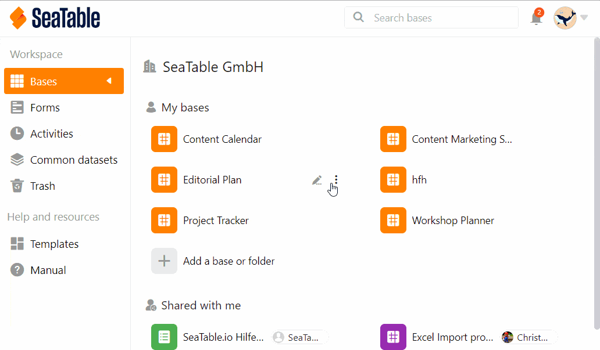
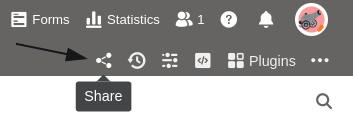
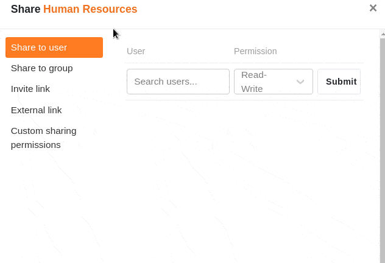
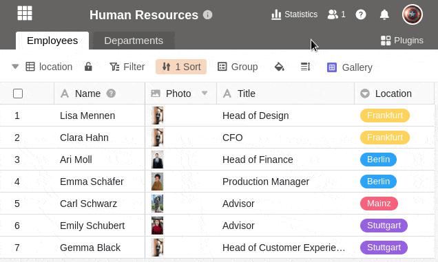
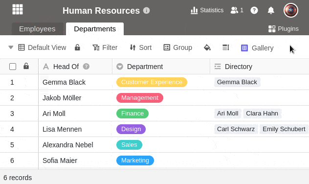



Uma permissão de partilha personalizada permite-lhe partilhar **várias tabelas e vistas** de uma base ao mesmo tempo. Isto poupa-lhe muito trabalho se quiser partilhar numerosas tabelas e vistas com os membros da sua equipa, mas não uma base inteira.

Apesar desta partilha agrupada, pode definir em pormenor a **autorização** desejada, uma vez que pode selecionar individualmente para cada tabela e vista se deve ser concedida uma **partilha de leitura e escrita** ou apenas uma **partilha de leitura**.

Por exemplo, pode especificar que concede acesso de leitura e escrita à primeira tabela de uma base, acesso apenas de leitura à segunda tabela e nenhum acesso a todas as outras tabelas.

Depois de ter criado uma partilha personalizada, pode enviá-la a **membros individuais da equipa** ou a **grupos inteiros**.

## Como criar uma permissão de partilha personalizada

Há **duas** formas de partilhar tabelas e vistas individuais de uma base:

- A partir da **página inicial**
- Através do **ícone de partilha** na base

### A partir da página inicial

1. Vá para a **página inicial do SeaTable**.
2. Mova o ponteiro do rato para a base que pretende partilhar e clique nos **três pontos** que aparecem à direita.
3. Clique em **Partilhar**.
4. Selecione o item de menu **Permissão de partilha personalizada**.
5. Clique em **Adicionar permissão**.
6. Dê um **nome** à permissão e acrescente uma **descrição**.
7. Coloque **vistos** ao lado das tabelas e vistas individuais que pretende partilhar, decidindo se pretende atribuir permissões de **leitura e escrita** ou **permissões apenas de leitura**.

### Através do ícone de partilha na base

1. Abra a **base** a partir da qual deseja partilhar tabelas ou vistas individuais.
2. No canto superior direito das **opções da base**, clique em **Partilhar** .
3. Abre-se a mesma **janela de partilha** que na primeira via. Siga as **instruções de clique** acima, a partir do passo 4, para criar a partilha.

## Enviar a partilha a utilizadores ou grupos

A permissão de partilha criada está agora disponível como opção em **Partilhar com utilizador** ou **Partilhar com grupo** nas autorizações. Para enviar a partilha personalizada, proceda do seguinte modo:

1. Na coluna da esquerda da janela de partilha, clique em **Partilhar com grupo** ou **Partilhar com utilizador**.
2. Selecione o **grupo** ou os **utilizadores** para os quais pretende enviar a partilha personalizada.
3. No campo **Direitos**, pode agora selecionar a **permissão de partilha** previamente criada com o respetivo nome.
4. Confirme a partilha com **Submeter**.

Explicações detalhadas sobre o que deve considerar ao partilhar com utilizadores ou grupos podem ser encontradas nos artigos seguintes:

- [Partilhar uma base com um utilizador]()
- [Partilhar uma base com um grupo]()

## Consequências da partilha

As tabelas e vistas partilhadas podem ser encontradas no **espaço de trabalho** do grupo ou utilizador na **página inicial**. Estas são sempre apresentadas com a nota **Partilhada**.

As tabelas e vistas partilhadas exclusivamente para **leitura** **só** podem, consequentemente, ser vistas e **não** editadas. Se clicar na tabela, nada acontece:

As tabelas e vistas partilhadas para **leitura e escrita**, por outro lado, podem ser tanto visualizadas como **editadas**. As suas alterações são visíveis para todos os utilizadores com acesso à tabela:



## Editar permissões de partilha personalizadas

Pode alterar retrospetivamente as permissões de partilha personalizadas, **removendo** de novo **tabelas e vistas** individuais da partilha ou **ajustando** o **tipo de partilha**.

1. Clique em **Permissões de partilha personalizadas** e passe o rato sobre a **permissão** que pretende personalizar.
2. Clique no **ícone do lápis** que aparece .
3. Agora pode alterar o **nome** e a **descrição** da permissão.
4. Abaixo disto, tem a opção de remover novamente os vistos definidos para **tabelas** e **vistas** individuais da base ou ajustar se estas devem ser partilhadas para **leitura e escrita** ou apenas para **leitura**.
5. Confirme com **Submeter** para guardar a **permissão de partilha**.

## Limitações

- **Só** pode partilhar tabelas e vistas com grupos dos quais já é **membro**.
- Pode partilhar em qualquer altura tabelas e vistas de bases que **criou você mesmo**, ao passo que as tabelas e vistas de bases pertencentes a um grupo só podem ser partilhadas com outros grupos ou utilizadores pelos **proprietários** e **administradores**.

## Perguntas mais frequentes

No SeaTable, deve sempre introduzir conjuntos de dados relacionados na mesma base. Se quiser **partilhar** apenas **uma parte dos dados** com alguém, então as partilhas personalizadas são o caminho a seguir.

**Não**, atualmente só pode enviar partilhas personalizadas a um **membro da equipa** ou a um **grupo**.


