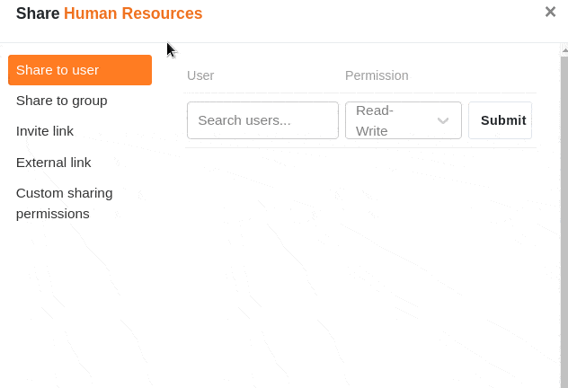



Пользовательское разрешение на общий доступ позволяет вам одновременно предоставлять общий доступ к **нескольким таблицам и представлениям** из базы. Это сэкономит вам много работы, если вы хотите поделиться множеством таблиц и представлений с членами вашей команды, но не всей базой.

Несмотря на этот пакетный релиз, вы можете детально определить желаемую **авторизацию**, поскольку для каждой таблицы и представления можно выбрать, будет ли предоставлена **авторизация** на **чтение и запись** или только на **чтение**.

Например, вы можете указать, что предоставляете доступ на чтение и запись к первой таблице базы, доступ только на чтение ко второй таблице и полное отсутствие доступа ко всем остальным таблицам.

Создав пользовательский ресурс, вы можете отправить его **отдельным членам команды** или **целым группам**.

## Чтобы создать пользовательское разрешение общего доступа

Существует **два** способа освобождения отдельных таблиц и представлений базы:

- С **главной** страницы
- Через **значок общего доступа** в Базе

### С главной страницы

1. Перейдите на **домашнюю страницу SeaTable**.
2. Подведите указатель мыши к базе, которую вы хотите разделить, и нажмите на **три точки**, которые появятся справа.
3. Нажмите кнопку **Освободить**.
4. Выберите пункт меню **Custom Share Permission**.
5. Нажмите кнопку **Добавить разрешение**.
6. Дайте разрешению **имя** и добавьте **описание**.
7. Поставьте **галочки** рядом с отдельными таблицами и представлениями, к которым вы хотите предоставить общий доступ, решив, хотите ли вы назначить разрешения на **чтение и запись** или **разрешения только на чтение**.

### Через значок общего доступа в Базе

1. Откройте **базу**, из которой вы хотите предоставить общий доступ к отдельным таблицам или представлениям.
2. В правом верхнем углу **опций базы** нажмите **Поделиться** .
3. Откроется то же **окно общего доступа**, что и в первом способе. Для создания общего ресурса следуйте **инструкциям по щелчку**, приведенным выше в шаге 4.

## Отправить общий ресурс пользователям или группам

Созданное разрешение на выпуск теперь доступно для выбора в качестве опции в разделе " **Выпуск для пользователя** " или " **Выпуск для группы** " в полномочиях. Чтобы отправить настроенную акцию, выполните следующие действия:

1. В левой колонке окна "Общий доступ" нажмите " **Общий доступ для группы** " или " **Общий доступ для пользователя**".
2. Выберите **группу** или **пользователей**, которым вы хотите отправить пользовательский общий ресурс.
3. В поле " **Права"** теперь можно выбрать ранее созданное **разрешение на выпуск** под соответствующим именем.
4. Подтвердите освобождение с помощью кнопки **Отправить**.

Подробные объяснения того, что следует учитывать при совместном использовании с пользователями или группами, можно найти в следующих статьях:

- [Выдача базы пользователю](https://seatable.io/ru/docs/freigabelinks/anlegen-einer-benutzerfreigabe/)
- [Освобождение базы для группы](https://seatable.io/ru/docs/freigabelinks/freigabe-einer-base-an-eine-gruppe/)

## Последствия освобождения

Общие таблицы и представления можно найти в **рабочем пространстве** группы или пользователя на **начальной** странице. Они всегда отображаются с пометкой **Shared**.

Таблицы и представления, выпущенные исключительно для **чтения**, можно, соответственно, **только** просматривать, но **не** редактировать. Если вы щелкните мышью в таблице, ничего не произойдет:

С другой стороны, таблицы и представления, освобожденные для **чтения и записи**, можно как просматривать, так и **редактировать**. Ваши изменения видны всем пользователям, имеющим доступ к таблице:



## Редактирование пользовательских разрешений совместного доступа

Настроенные разрешения общего доступа можно изменить задним числом, **удалив** отдельные **таблицы и представления** из общего доступа или **изменив тип общего доступа**.

1. Нажмите **Custom Share Permissions** и наведите курсор на **разрешение**, которое вы хотите настроить.
2. Нажмите на появившийся **значок карандаша** .
3. Теперь вы можете изменить **имя** и **описание** разрешения.
4. Ниже у вас есть возможность снова снять галочки, установленные для отдельных **таблиц** и **представлений** базы, или настроить, должны ли они быть освобождены для **чтения и записи** или только для **чтения**.
5. Подтвердите команду **Отправить**, чтобы сохранить **разрешение на освобождение**.

## Ограничения

- Вы можете обмениваться таблицами и представлениями **только** с группами, **членом** которых вы уже являетесь.
- Вы можете в любой момент поделиться таблицами и представлениями баз, которые **создали сами**, в то время как таблицы и представления баз, принадлежащих группе, могут быть доступны другим группам или пользователям только **владельцами** и **администраторами**.

## Часто задаваемые вопросы

В SeaTable вы всегда должны вводить связанные наборы данных в одну и ту же базу. Если вы хотите **поделиться** с кем-то только **частью данных**, то вам подойдут определяемые пользователем доли.

**Нет**, в настоящее время пользовательские акции можно отправлять только **членам команды** или **группы**.


