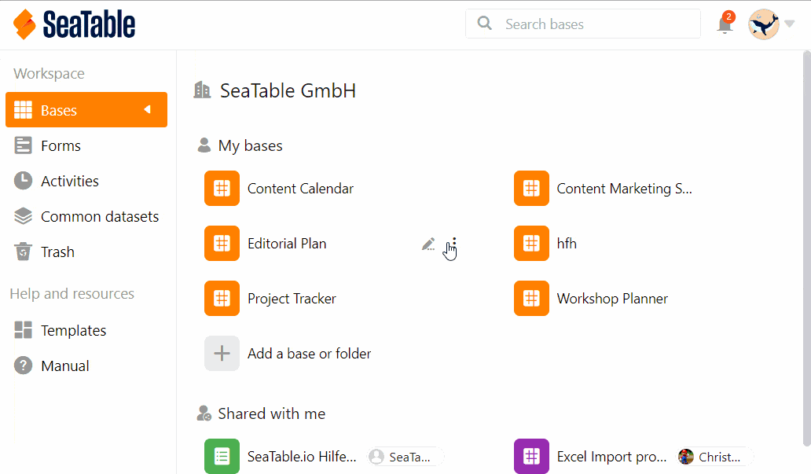

Bases gehören in SeaTable immer einem **Benutzer** oder einer **Gruppe**. Daher können Sie Bases entweder an Gruppen oder [an einzelne Benutzer freigeben](https://seatable.io/docs/freigaben/anlegen-einer-benutzerfreigabe/). Dieser Artikel beleuchtet die Freigabe einer Base an eine gesamte Gruppe.

Hierbei können Sie für jede Base individuell entscheiden, ob es sich um eine **Lesefreigabe** oder um eine **Lese- und Schreibfreigabe** handeln soll. 

Sie können Ihre Bases sowohl **von der Startseite aus** als auch **innerhalb einer Base** freigeben.

## Eine Base von der Startseite aus freigeben

1. Gehen Sie auf die **Startseite von SeaTable**.
2. Bewegen Sie den Mauszeiger auf die **Base**, die Sie teilen möchten, und klicken Sie auf die rechts erscheinenden **drei Punkte**.
3. Klicken Sie auf **Freigeben**.
4. Gehen Sie auf **Freigabe für Gruppe**.
5. Wählen Sie die gewünschte **Gruppe** aus, an die Sie die **Base** freigeben möchten.
6. Stellen Sie ein, ob Sie **Lese- und Schreibrechte** oder nur **Leserechte** vergeben möchten.
7. Klicken Sie auf **Absenden**.

## Freigabe innerhalb der Base

Wenn Sie sich gerade **in einer Base** befinden, können Sie auch eine Freigabe erstellen, ohne auf die Startseite wechseln zu müssen. Klicken Sie dazu auf das **Teilen-Icon**  rechts oben bei den **Base-Optionen**. Das Fenster, das sich zum Erstellen einer Freigabe öffnet, sieht genauso aus wie das auf der Startseite. Befolgen Sie einfach die obige Klickanleitung ab Schritt 4.

## Limitationen

- Sie können Bases **ausschließlich** an Gruppen freigeben, in denen Sie bereits **Mitglied** sind.
- Bases, die Sie **selbst erstellt** haben, können Sie jederzeit freigeben, während Bases, die zu einer Gruppe gehören, nur von **Eigentümern** und **Administratoren** an andere Gruppen freigegeben werden können.
- Eine Gruppe, die von Ihnen eine Base freigegeben bekommen hat, besitzt **keine Eigentümerrechte** und kann somit beispielsweise **nicht** den Namen der Base ändern.

Wie Sie **einzelne Tabellen und Ansichten** einer Base an eine Gruppe freigeben können, erfahren Sie im Artikel [Benutzerdefinierte Freigabe erstellen](https://seatable.io/docs/freigaben/benutzerdefinierte-freigabe-erstellen/).
