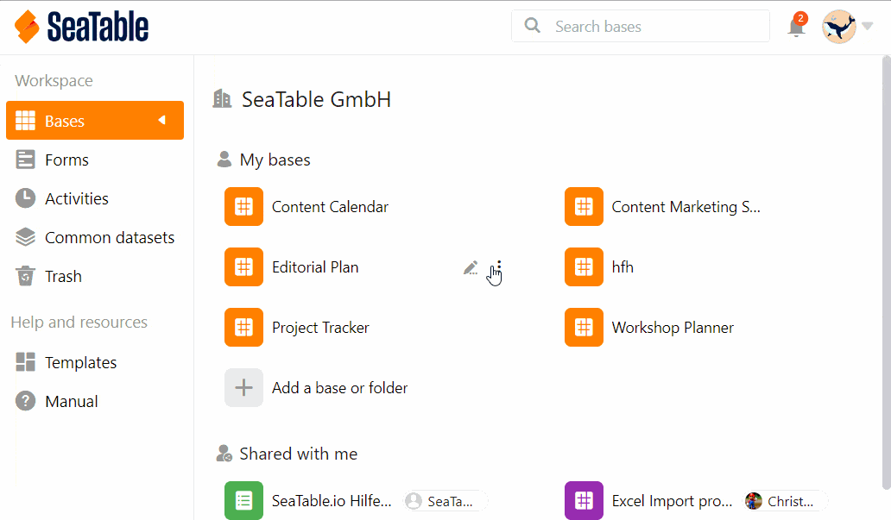

Bases in SeaTable always belong to a **user** or a **group**. Therefore, you can share bases either with groups or [with individual users](). This article highlights sharing a base with an entire group.

Here you can decide individually for each base whether it is a sharing with **read** or **read-write** sharing permission..



## Share a Base from the Home Page

1. Go to the **home page of SeaTable**.
2. Move the mouse cursor to the **base** you want to split and click the **three dots** that appear on the right.
3. Click **Share**.
4. Go to **Share with group**.
5. Select the desired **group** to which you want to share the **Base**.
6. Set whether you want to assign **read and write permissions** or **read-only permissions**.
7. Click **Submit**.

## Share within Base

If you are currently **in a Base**, you can also create a share without having to switch to the Home screen. To do this, click the **Share icon**  at the top right of the **Base options**. The window that opens to create a share looks just like the one on the Home page. Just follow the above clicking instructions starting from step 4.

## Limitations

- You can **only** share bases with groups you are already a **member of**.
- Bases that you have **created yourself** can be shared at any time, while bases that belong to a group can only be shared with other groups by **owners** and **administrators**.
- A group that has been shared a base by you has **no owner rights** and thus **cannot** change the name of the base, for example.

To learn how to share **individual tables and views** of a Base with a group, see the article [Create Custom Sharing Permissions]().
