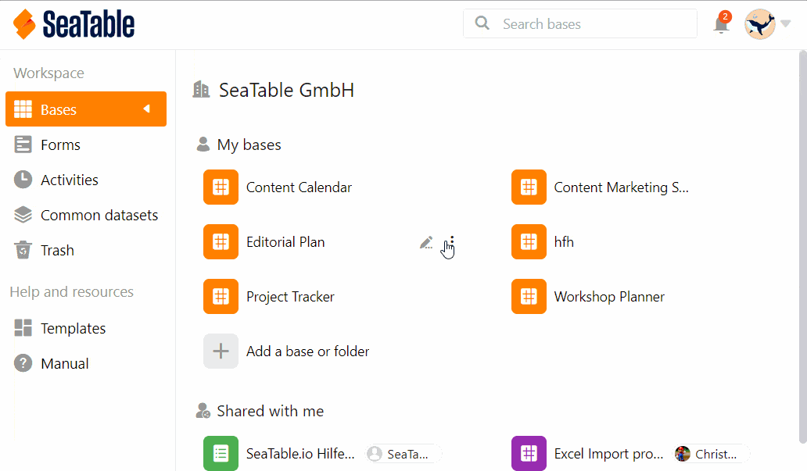

Las bases en SeaTable siempre pertenecen a un **usuario** o a un **grupo**. Por lo tanto, puede compartir bases con grupos o [con usuarios individuales](). Este artículo trata sobre cómo compartir una base con un grupo entero.

Aquí puede decidir individualmente para cada base si debe ser una **compartición de lectura** o una **compartición de lectura y escritura**.



Puede compartir sus bases tanto **desde la página de inicio** como **dentro de una base**.

## Compartir una base desde la página de inicio

1. Vaya a la **página de inicio de SeaTable**.
2. Mueva el puntero del ratón a la **base** que desea compartir y haga clic en los **tres puntos** que aparecen a la derecha.
3. Haga clic en **Compartir**.
4. Vaya a **Compartir con grupo**.
5. Seleccione el **grupo** deseado con el que desea compartir la **base**.
6. Establezca si desea asignar **derechos de lectura y escritura** o solo **derechos de lectura**.
7. Haga clic en **Enviar**.

## Compartición dentro de la base

Si se encuentra **en una base**, también puede crear una compartición sin tener que cambiar a la página de inicio. Para ello, haga clic en el **icono de compartir**  situado en la parte superior derecha de las **opciones de la base**. La ventana que se abre para crear una compartición es exactamente igual a la de la página de inicio. Solo tiene que seguir las instrucciones anteriores a partir del paso 4.

## Limitaciones

- **Solo** puede compartir bases con grupos de los que ya sea **miembro**.
- Las bases que ha **creado usted mismo** pueden compartirse en cualquier momento, mientras que las bases que pertenecen a un grupo solo pueden compartirse con otros grupos por **los propietarios** y **administradores**.
- Un grupo con el que ha compartido una base **no tiene derechos de propietario** y, por tanto, **no puede**, por ejemplo, cambiar el nombre de la base.

Para saber cómo compartir **tablas y vistas individuales** de una base con un grupo, consulte el artículo [Crear una compartición personalizada]().
