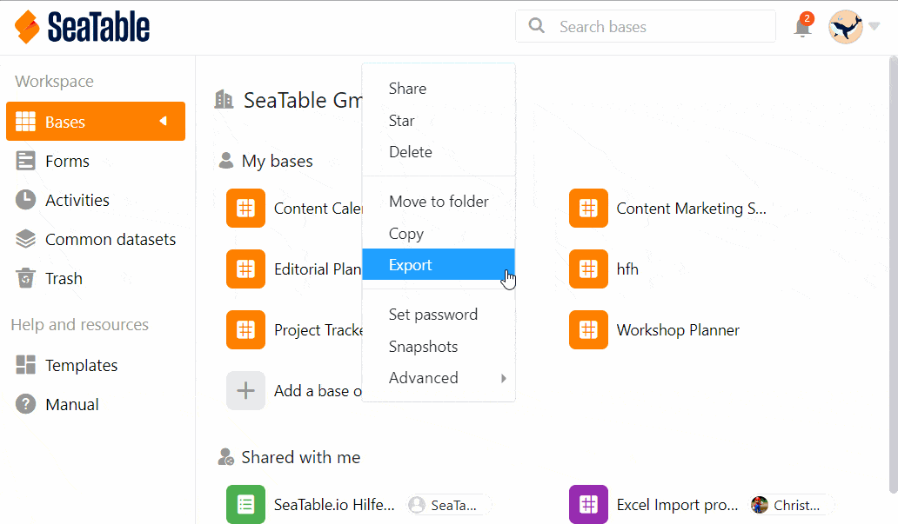

Using the **invitation link**, you can share bases with another person in SeaTable without that person becoming part of your team.

The person must **log in** or **register to** get access to the base you send. In doing so, they become an **administrator** themselves and can create their own team. However, you can still work together on the base you shared.

## To create an invitation link for a base

1. Go to the **home page of SeaTable**.
2. Move the mouse cursor to the **base** you want to split and click the **three dots** that appear on the right.
3. Select the **Share** option.
4. Set whether you want to assign **read and write permissions** or **read-only permissions**.
5. Set a **password** if needed and/or choose an **expiration date for** the link.
6. Click **Create**.
7. You can now copy and send the **invitation link**.

## Security aspects of invitation links

An **invitation link** also gives anyone who has access to the link access to the contents of the base for which the link was created. To make access more secure, you should add a **password** and/or **expiration date to** the link.

It is also recommended to monitor all links regularly. You can view a list of all invitation links in the **team administration** and also delete them there.
