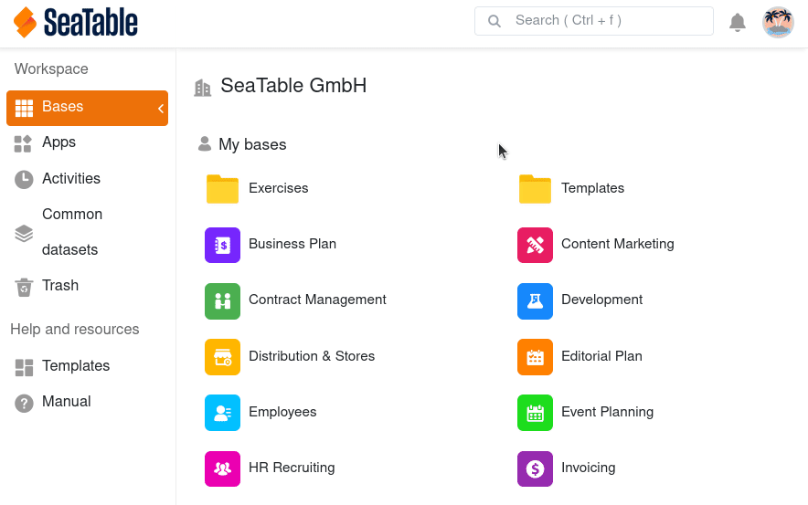

Используя **пригласительную ссылку**, вы можете поделиться базами с другим человеком в SeaTable без того, чтобы этот человек стал частью вашей команды.

Человек должен **войти** в систему или **зарегистрироваться**, чтобы получить доступ к базе, которую вы ему отправили. При этом он сам становится **администратором** и может создать свою команду. Однако вы можете продолжать совместно работать в базе, которой вы поделились.



Администратор команды может глобально запретить использование пригласительных ссылок в управлении командой. Ссылки всё ещё можно создавать, но при их открытии возникнет ошибка.

Подробнее см. статью [Разрешить обмен базами по пригласительной ссылке]().



## Как создать пригласительную ссылку для базы

1. Перейдите на **домашнюю страницу SeaTable**.
2. Подведите указатель мыши к **базе**, которой вы хотите поделиться, и нажмите на **три точки**, которые появятся справа.
3. Выберите опцию **Поделиться**.
4. Нажмите на **Пригласительная ссылка**.
5. Установите, хотите ли вы назначить **права на чтение и запись** или только **на чтение**.
6. Кроме того, решите, хотите ли вы добавить **защиту паролем**, **срок действия** и **описание**, установив соответствующие флажки.
7. Нажмите кнопку **Создать**.

Теперь вы можете **скопировать пригласительную ссылку** и отправить ее.

## Аспекты безопасности пригласительных ссылок

Пригласительная ссылка дает любому, кто имеет доступ к ссылке, также **доступ к содержимому базы**, для которой была создана ссылка. Чтобы сделать доступ более безопасным, следует добавить к ссылке **пароль** и/или **срок действия**.

Также рекомендуется регулярно отслеживать все ссылки. Вы можете просмотреть список всех пригласительных ссылок в **управлении командой** и там же удалить их.
