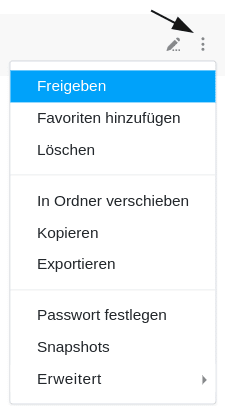
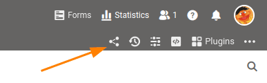

Não quer **partilhar** uma base inteira, mas sim **tabelas individuais**? Pode fazê-lo através de uma **partilha personalizada** para determinados [utilizadores]().

## Partilhar tabelas individuais através da página inicial

1. Mude para a **página inicial** do SeaTable.
2. Passe o rato sobre a **base** a partir da qual pretende partilhar tabelas individuais.
3. Clique nos **três pontos** que aparecem à direita.
4. Selecione o item de menu **Partilhar**.
5. Abre-se então uma **janela** na qual pode criar várias partilhas.

## Partilha dentro da base

Se estiver atualmente **numa base**, também pode criar uma partilha sem ter de mudar para a página inicial. Para o fazer, clique no **ícone de partilha**  no canto superior direito das **opções da base**. A janela que se abre para criar uma partilha é a mesma que na página inicial.

## Criar partilha personalizada

Para uma explicação detalhada dos passos necessários, consulte o artigo [Criar partilha personalizada]().
