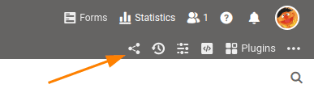

Não quer **partilhar** uma base inteira, mas sim **tabelas individuais**? Pode fazê-lo através de um **lançamento definido pelo utilizador** para [utilizadores]() inteiros.

## Partilhar tabelas individuais através da página inicial

1. Mudar para a página **inicial** da SeaTable.
2. Mova o rato sobre a **base** a partir da qual pretende libertar tabelas individuais.
3. Clique nos **três pontos** que aparecem do lado direito.
4. Seleccionar o item de menu **Libertar**.
5. Abre-se então uma **janela** na qual se pode criar várias acções.

## Lançamento dentro da base

Se estiver actualmente **numa base**, também pode criar uma acção sem ter de mudar para a página inicial. Para o fazer, clique no **ícone de partilha**  no canto superior direito das **opções da base**. A janela que se abre para criar uma acção é a mesma que na página inicial.

## Criar partilha personalizada

Para uma explicação detalhada dos passos necessários, ver o artigo [Criando uma Acção Personalizada]().
