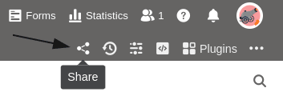
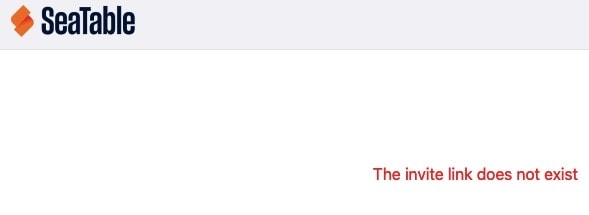
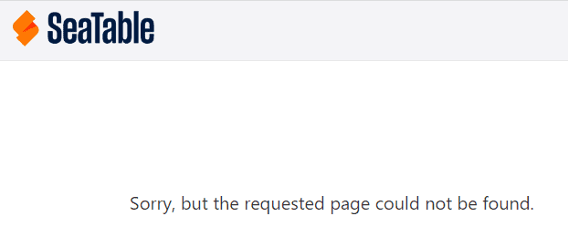

Puede **eliminar** tanto los **enlaces externos** como **los enlaces de invitación** en cualquier momento y de dos formas distintas. Tenga en cuenta qué consecuencias tiene la eliminación para el acceso a sus datos.

## Formas de eliminar enlaces externos y enlaces de invitación

- Supresión mediante el icono de compartir  para bases o vistas
- Supresión a través de la [administración del equipo]()



## Eliminación mediante el icono de compartir

1. Abra la **base** o **vista** cuyo enlace desea eliminar.
2. Haga clic en el **icono de compartir**  para bases o vistas.
3. Dependiendo del tipo de enlace que desee eliminar, haga clic en **Enlace de invitación** o **Enlace externo**.
4. Mueva el ratón sobre el enlace y haga clic en el **símbolo x**.

## Supresión a través de la administración del equipo



1. Vaya a la **página de inicio** de SeaTable y haga clic en la **imagen de** su **avatar**.

3. Abra la **gestión de equipos de** su cuenta.
4. Haga clic en **Bases** en la navegación.
5. Dependiendo del tipo de enlace que desee eliminar, haga clic en **Enlaces de invitación** o **Enlaces externos**.
6. Seleccione el **enlace** que desea eliminar.
7. Confirme la eliminación activando la tecla **Controlador** y haga clic en **Borrar enlace de invitación** (para los enlaces de invitación) o **Suprimir liberación** (para enlaces externos).  
   



No se puede eliminar un [enlace externo para una vista]() a través de la administración del equipo, sino sólo a través del icono de compartir para las vistas.



## Consecuencias de la supresión

### Supresión de un enlace de invitación

La supresión de un **enlace de invitación** tiene las siguientes **consecuencias**:

Si los usuarios intentan abrir un enlace de invitación **eliminado**, aparece el siguiente **mensaje de error**.

Una vez eliminado el enlace de invitación, **ningún otro usuario** podrá acceder a la base compartida.



Los usuarios que aceptaron tu invitación antes de que se borrara el enlace pueden seguir accediendo a la base compartida y aparecen en la lista de [usuarios compartidos](). Sin embargo, por supuesto puedes eliminar el recurso compartido allí.



### Supresión de un enlace externo

La supresión de un **enlace** externo tiene las siguientes **consecuencias**:

Si los usuarios intentan abrir un enlace externo **eliminado**, aparece el siguiente **mensaje de error**.

Al eliminar un enlace externo, todos los usuarios **pierden el** acceso a los datos. Incluso los sitios web en los que se ha incrustado una vista a través de un enlace externo ya no pueden mostrar los datos.
