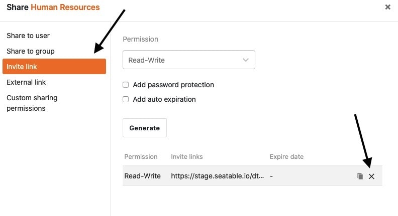

Vous pouvez **supprimer** à tout moment les **liens externes** et **les liens d'invitation** de deux manières différentes. Attention aux conséquences de la suppression sur l'accès à vos données.

## Moyens de supprimer les liens externes et les liens d'invitation

- Suppression via l'icône de partage  pour les bases ou les vues
- Suppression via [l'administration d'équipe]()



## Suppression via l'icône de partage

1. Ouvrez une **base** ou une **vue** pour laquelle vous souhaitez supprimer un lien.
2. Cliquez sur l'**icône de partage**  pour les bases ou les vues.
3. Selon le type de lien que vous souhaitez supprimer, cliquez soit sur **Lien d'invitation**, soit sur **Lien externe**.
4. Passez avec la souris sur le lien et cliquez sur le **symbole x**.

## Suppression via l'administration d'équipe



1. Allez sur la **page d'accueil** de SeaTable et cliquez sur l'**image de** votre **avatar**.

3. Ouvrez l'**administration d'équipe** de votre compte.
4. Cliquez dans la navigation sur **Bases**.
5. Selon le type de lien que vous souhaitez supprimer, cliquez soit sur **Liens d'invitation**, soit sur **Liens externes**.
6. Sélectionnez le **lien** à supprimer.
7. Confirmez la suppression en activant le bouton "Supprimer". **Régulateur** et cliquez sur **Supprimer le lien d'invitation** (pour les liens d'invitation) ou **Supprimer la validation** (pour les liens externes).  
   



Vous ne pouvez pas supprimer un [lien externe pour une vue]() via l'administration d'équipe, mais uniquement via l'icône de partage pour les vues.



## Conséquences de la suppression

### Suppression d'un lien d'invitation

La suppression d'un **lien d'invitation** a les **conséquences** suivantes :

Si les utilisateurs tentent d'ouvrir un lien d'invitation **supprimé**, le **message d'erreur** suivant s'affiche.

Par conséquent, une fois le lien d'invitation supprimé, **aucun autre utilisateur** ne peut avoir accès à la base partagée.



Les utilisateurs qui ont accepté votre invitation avant la suppression du lien peuvent toujours accéder à la base partagée et sont répertoriés dans les [partages d'utilisateurs](). Vous pouvez bien sûr y supprimer le partage.



### Suppression d'un lien externe

La suppression d'un **lien externe** a les **conséquences** suivantes :

Si les utilisateurs tentent d'ouvrir un lien externe **supprimé**, le **message d'erreur** suivant s'affiche.

Après la suppression d'un lien externe, tous les utilisateurs **perdent** par conséquent l'accès aux données. De même, les sites web dans lesquels vous avez intégré une vue via un lien externe ne peuvent plus afficher les données.
