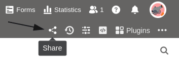
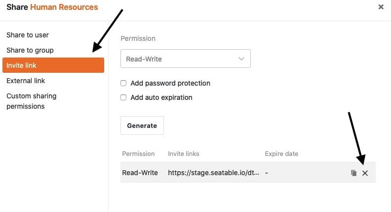
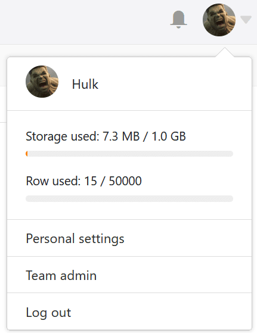
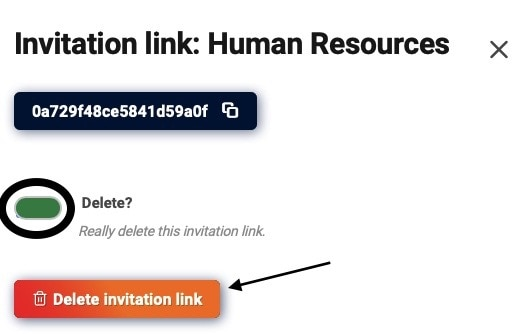
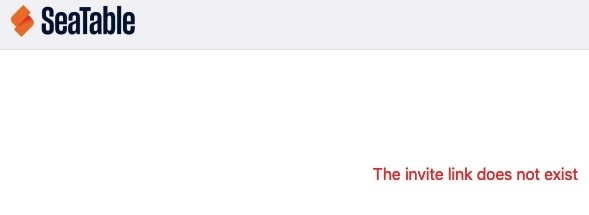
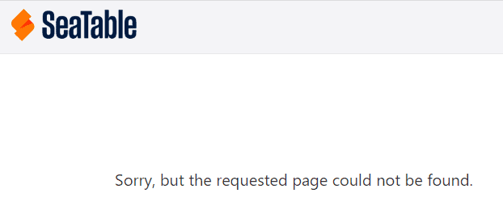

Pode **apagar** tanto as **ligações externas** como as **ligações de convite** em qualquer altura de duas formas diferentes. Por favor, tenha em atenção as consequências que a eliminação tem para o acesso aos seus dados.

## Formas de eliminar ligações externas e ligações de convite

- Eliminação através do ícone de partilha  para bases ou vistas
- Eliminação através da [administração da equipa]()



## Eliminação através do ícone de acção

1. Abrir uma **base** ou **vista para** a qual deseja apagar um link.
2. Clique no **ícone de partilha**  para bases ou vistas.
3. Dependendo do tipo de link que pretende eliminar, clique em **Convite** ou **Link Externo**.
4. Mova o rato sobre o link e clique no **símbolo x**.

## Eliminação através da administração da equipa



1. Ir para a **página inicial do** SeaTable e clicar na sua **imagem de avatar**.

3. Abra a **gestão de equipa da** sua conta.
4. Clique em **Bases** na navegação.
5. Dependendo do tipo de link que pretende eliminar, clique em **Links de Convite** ou **Links Externos**.
6. Seleccione o **link** que pretende eliminar.
7. Confirmar a eliminação activando o **Controlador** e clique em **Eliminar link do convite** (para ligações de convite) ou **Apagar liberação** (para ligações externas).  
   



Não se pode eliminar uma [ligação externa para uma visualização]() através da administração da equipa, mas apenas através do ícone de partilha de visualizações.



## Consequências da eliminação

### Eliminação de um link de convite

A eliminação de um **link de convite** tem as seguintes **consequências**:

Se os utilizadores tentarem abrir um link de convite **eliminado**, aparece a seguinte **mensagem de erro**.

Depois de eliminar o link do convite, **nenhum outro utilizador** pode aceder à base partilhada.



Os utilizadores que aceitaram o seu convite antes do link ter sido eliminado podem ainda aceder à base partilhada e estão listados nas [partilhas de utilizadores](). No entanto, é claro que pode apagar a partilha aí.



### Eliminação de uma ligação externa

A eliminação de uma **ligação externa** tem as seguintes **consequências**:

Se os utilizadores tentarem abrir uma ligação externa **eliminada**, aparece a seguinte **mensagem de erro**.

Após a eliminação de uma ligação externa, todos os utilizadores **perdem** consequentemente o acesso aos dados. Mesmo os sítios web nos quais tenha incorporado uma visualização através de uma ligação externa já não podem exibir os dados.
