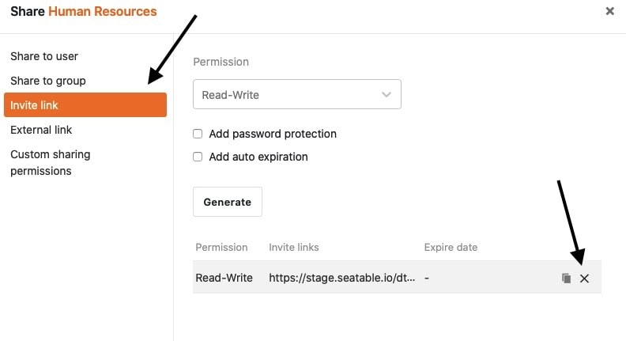
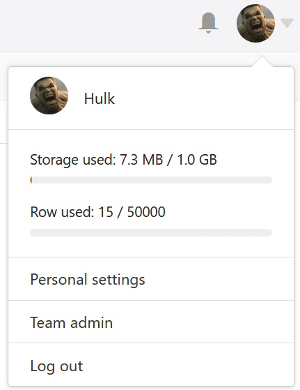
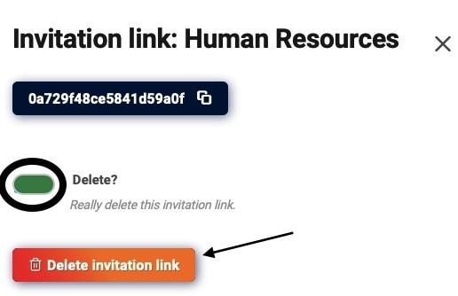
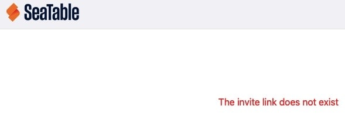
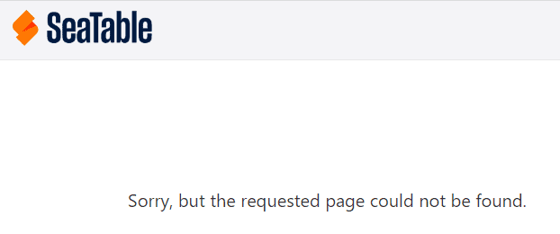

Pode **apagar** tanto as **ligações externas** como os **links de convite** em qualquer altura, de duas formas diferentes. Tenha em atenção as consequências que a eliminação tem para o acesso aos seus dados.

## Formas de eliminar ligações externas e links de convite

- Eliminação através do ícone de partilha  para bases ou vistas
- Eliminação através da [administração da equipa]()



## Eliminação através do ícone de partilha

1. Abra uma **base** ou **vista** para a qual deseja apagar uma ligação.
2. Clique no **ícone de partilha**  para bases ou vistas.
3. Consoante o tipo de ligação que pretende eliminar, clique em **Link de convite** ou em **Ligação externa**.
4. Passe o rato sobre a ligação e clique no **símbolo x**.

## Eliminação através da administração da equipa



1. Vá para a **página inicial** do SeaTable e clique na sua **imagem de avatar**.

2. Abra a **administração da equipa** da sua conta.
3. Clique em **Bases** na navegação.
4. Consoante o tipo de ligação que pretende eliminar, clique em **Links de convite** ou em **Ligações externas**.
5. Selecione a **ligação** que pretende eliminar.
6. Confirme a eliminação ativando o **regulador** e clique em **Eliminar link de convite** (para links de convite) ou **Apagar partilha** (para ligações externas).  
   



Não pode eliminar uma [ligação externa para uma vista]() através da administração da equipa, mas apenas através do ícone de partilha para vistas.



## Consequências da eliminação

### Eliminação de um link de convite

A eliminação de um **link de convite** tem as seguintes **consequências**:

Se os utilizadores tentarem abrir um link de convite **eliminado**, aparece a seguinte **mensagem de erro**.

Depois de eliminar o link de convite, **nenhum outro utilizador** pode aceder à base partilhada.



Os utilizadores que aceitaram o seu convite antes de a ligação ter sido eliminada podem continuar a aceder à base partilhada e estão listados nas [partilhas de utilizador](). No entanto, pode naturalmente apagar aí a partilha.



### Eliminação de uma ligação externa

A eliminação de uma **ligação externa** tem as seguintes **consequências**:

Se os utilizadores tentarem abrir uma ligação externa **eliminada**, aparece a seguinte **mensagem de erro**.

Após a eliminação de uma ligação externa, todos os utilizadores **perdem** consequentemente o acesso aos dados. Mesmo os sites nos quais tenha incorporado uma vista através de uma ligação externa já não conseguem apresentar os dados.
