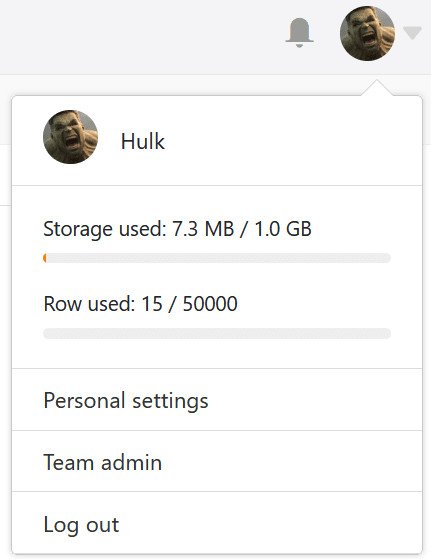
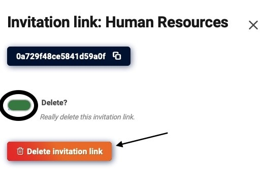

Вы можете в любое время **удалить** как **внешние ссылки**, так и **пригласительные ссылки** двумя различными способами. Обратите внимание, какие последствия имеет удаление для доступа к вашим данным.

## Способы удаления внешних ссылок и пригласительных ссылок

- Удаление через значок поделиться  для баз или просмотров
- Удаление через [администрацию команды](https://seatable.io/ru/docs/teamverwaltung-abonnement/die-funktionen-der-teamverwaltung-in-der-uebersicht/)



## Удаление через значок общего доступа

1. Откройте **базу** или **представление, для** которого вы хотите удалить ссылку.
2. Нажмите на **значок поделиться**  для получения баз или просмотров.
3. В зависимости от того, какой тип ссылки вы хотите удалить, щелкните **ссылку приглашения** или **внешнюю ссылку**.
4. Наведите курсор мыши на ссылку и нажмите на **символ x**.

## Удаление через администрацию команды



1. Зайдите на **главную страницу** SeaTable и нажмите на **изображение** своего **аватара**.

3. Откройте **управление командой** вашего аккаунта.
4. Нажмите на **Базы** в навигации.
5. В зависимости от того, какой тип ссылки вы хотите удалить, щелкните **Ссылки приглашений** или **Внешние ссылки**.
6. Выберите **ссылку**, которую нужно удалить.
7. Подтвердите удаление, активировав кнопку **Контроллер** и нажмите на **Удалить ссылку на приглашение** (для пригласительных ссылок) или **Удалить релиз** (для внешних ссылок).  
   



Вы не можете удалить [внешнюю ссылку для представления]() через администрацию команды, но только через значок общего доступа для представлений.



## Последствия удаления

### Удаление ссылки на приглашение

Удаление **пригласительной ссылки** имеет следующие **последствия**:

Если пользователи пытаются открыть ссылку на **удаленное** приглашение, появляется следующее **сообщение об ошибке**.

После удаления пригласительной ссылки **больше никто из пользователей не** сможет получить доступ к общей базе.



Пользователи, принявшие ваше приглашение до того, как ссылка была удалена, по-прежнему могут получить доступ к общей базе и числятся в списке [общих ресурсов пользователей](). Однако вы, конечно, можете удалить общий ресурс там.



### Удаление внешней ссылки

Удаление **внешней ссылки** имеет следующие **последствия**:

Если пользователи пытаются открыть **удаленную** внешнюю ссылку, появляется следующее **сообщение об ошибке**.

После удаления внешней ссылки все пользователи, соответственно, **теряют** доступ к данным. Даже веб-сайты, в которые вы встроили представление через внешнюю ссылку, больше не могут отображать данные.
