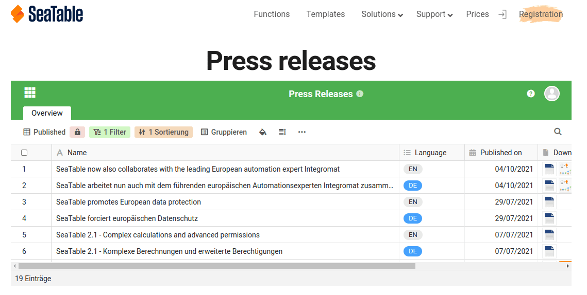



To share table views with users who are **not registered with SeaTable**, it is possible to create an external link for a view.

Basically, external links are **public** and thus accessible without logging in. They provide **read-only access to** the data that is in the shared view.

In addition, there are several options you can use to secure an external link:

- You have the option to set an **automatic expiration date for** an external link. After the selected number of days, the external link will lose its validity.
- In addition, you can also set any **password** for an external link. This must be entered correctly by another user to gain access to the view.

Everything else you should know about external links can be found in the article [Creating an External Link for a Base](https://seatable.io/en/docs/freigabelinks/externer-link-erklaert/).

## Create external link for a view

1. Open the **view of** a table you want to share.
2. Click **Share View**, and then click **External Link**.
3. If needed, set a custom or randomly generated **password** and/or **expiration date for** the link.
4. Choose whether you want to generate a **random URL** for the link or set a **desired URL** yourself.
5. Confirm with **Create**.
6. The created link will be displayed below and can be easily **copied**.

## Embedding in a website

You can also use external links to embed **views** in a web page. To do this, simply paste the **link** into the editor of your content management system.

For example, this is how the integration of a table with press releases looks on our press page:

