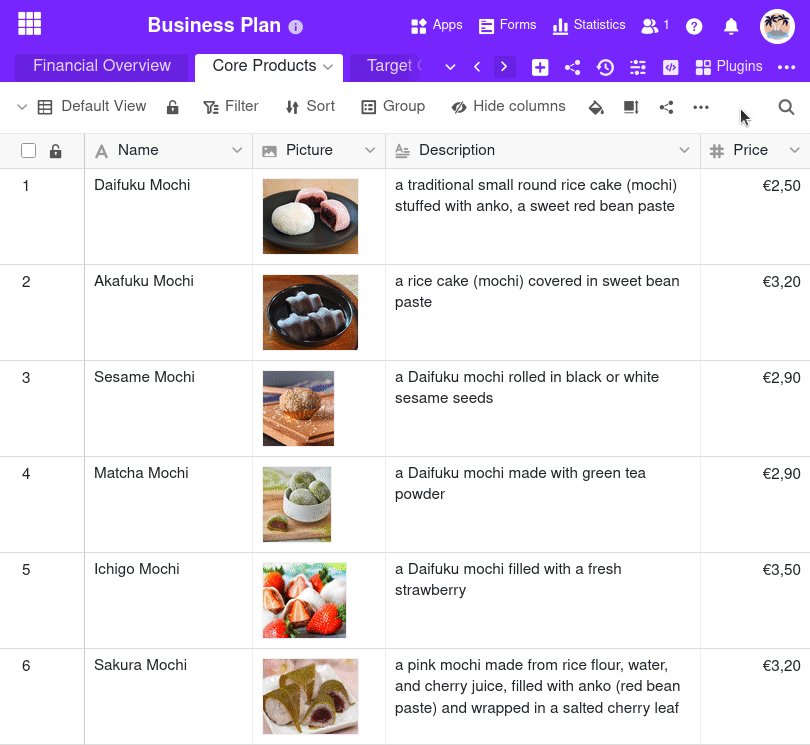
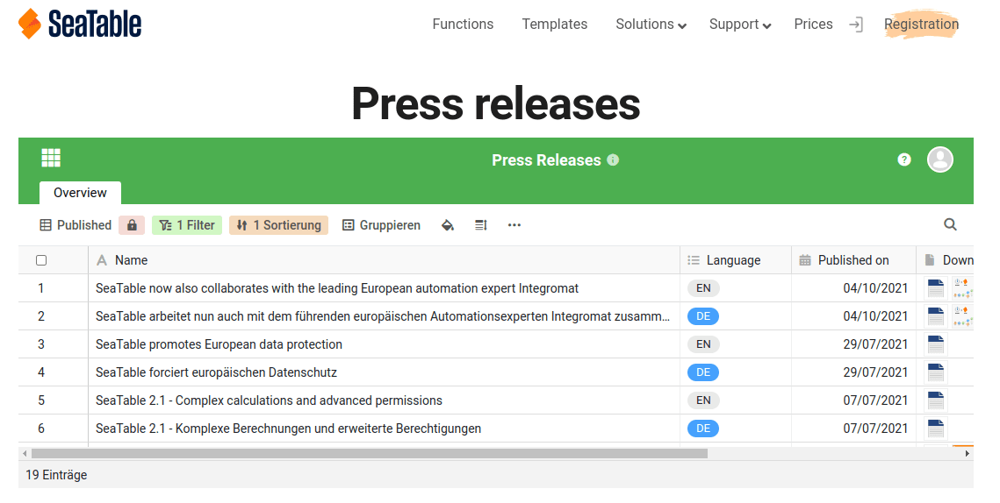



Para compartir vistas de tablas con usuarios que **no están registrados en SeaTable**, es posible crear un enlace externo para una vista.

En principio, los enlaces externos son **públicos** y, por tanto, accesibles sin necesidad de iniciar sesión. Proporcionan **acceso de solo lectura** a los datos de la vista compartida.

Además, dispone de varias opciones con las que puede asegurar un enlace externo:

- Tiene la posibilidad de fijar una **fecha de caducidad automática** para un enlace externo. Tras el número de días seleccionado, el enlace externo pierde su validez.
- Además, también puede establecer cualquier **contraseña** para un enlace externo. Este debe ser introducido correctamente por otro usuario para poder acceder a la vista.

Todo lo demás que debe saber sobre los enlaces externos se encuentra en el artículo [Crear un enlace externo para una base]().

## Crear un enlace externo para una vista

1. Abra una **vista** que desee compartir.
2. En las opciones de vista, haga clic en **Compartir vista** y luego en **Enlace externo**.
3. Si es necesario, establezca para el enlace su propia **contraseña** o una generada aleatoriamente, una **fecha de caducidad** y una **descripción**.
4. Seleccione si desea generar una **URL aleatoria** o definir usted mismo una **URL propia**.
5. Confirme con **Crear**.
6. El enlace creado se muestra a continuación y puede **copiarse** simplemente.

## Incrustación en un sitio web

También puede utilizar enlaces externos para **incrustar vistas en una página web**. Para ello, basta con insertar el enlace en el editor de su sistema de gestión de contenidos.

Por ejemplo, así podría verse la integración de una tabla con comunicados de prensa en un sitio web:

