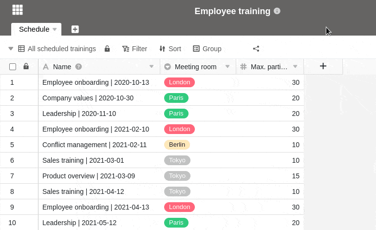
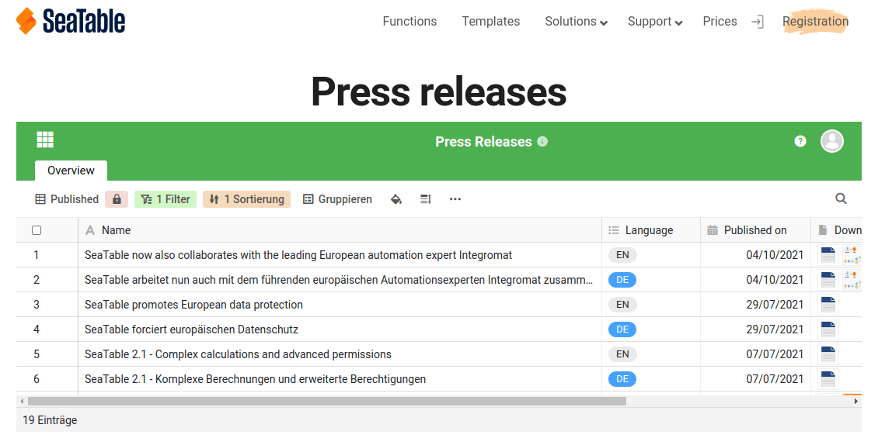



Pour partager des vues de tableaux avec des utilisateurs qui ne sont **pas enregistrés sur SeaTable**, il est possible de créer un lien externe pour une vue.

En principe, les liens externes sont **publics** et donc accessibles sans login. Ils offrent alors un **accès en lecture** seule aux données qui se trouvent dans la vue partagée.

Vous disposez en outre de différentes options pour sécuriser un lien externe :

- Vous avez la possibilité de définir une **date d'expiration automatique** pour un lien externe. Après le nombre de jours choisi, le lien externe perd sa validité.
- En outre, vous pouvez également définir un **mot de passe** de votre choix pour un lien externe. Celui-ci doit être saisi correctement par un autre utilisateur pour avoir accès à la vue.

Pour tout ce que vous devez savoir sur les liens externes, consultez l'article [Créer un lien externe pour une base]().

## Créer un lien externe pour une vue

1. Ouvrez la **vue** d'un tableau que vous souhaitez partager.
2. Cliquez sur **Partager la vue**, puis sur **Lien externe**.
3. Si nécessaire, définissez un **mot de passe** personnel ou généré de manière aléatoire et/ou une **date d'expiration** pour le lien.
4. Choisissez si vous souhaitez générer une **URL aléatoire** pour le lien ou définir vous-même une **URL souhaitée**.
5. Confirmez en cliquant sur **Créer**.
6. Le lien créé s'affiche ensuite en bas et peut être facilement **copié**.

## Intégration dans un site web

Vous pouvez également utiliser des liens externes pour intégrer **des vues** dans une page web. Pour cela, il suffit d'insérer le **lien** dans l'éditeur de votre système de gestion de contenu.

Voici par exemple à quoi ressemble l'intégration d'un tableau de communiqués de presse sur notre page de presse :

