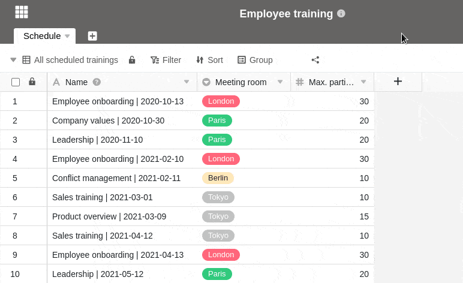



Чтобы поделиться представлениями таблицы с пользователями, **не зарегистрированными в SeaTable**, можно создать внешнюю ссылку для представления.

В принципе, внешние ссылки являются **общедоступными** и поэтому доступны без входа в систему. Они предоставляют **доступ только для чтения к** данным в общем представлении.

Кроме того, доступны различные варианты, с помощью которых можно закрепить внешнюю ссылку:

- У вас есть возможность установить **автоматический срок действия** внешней ссылки. По истечении выбранного количества дней внешняя ссылка теряет свою силу.
- Кроме того, вы можете установить любой **пароль** для внешней ссылки. Для получения доступа к просмотру он должен быть правильно введен другим пользователем.

Все остальное, что вы должны знать о внешних ссылках, можно найти в статье [Создание внешней ссылки для базы]().

## Создание внешней ссылки для представления

1. Откройте **представление** таблицы, к которой вы хотите предоставить общий доступ.
2. Нажмите на **Share View**, а затем на **External Link**.
3. При необходимости установите собственный или случайно сгенерированный **пароль** и/или **срок действия** ссылки.
4. Выберите, хотите ли вы сгенерировать **случайный URL** для ссылки или определить **нужный URL** самостоятельно.
5. Подтвердите команду " **Создать**".
6. Созданная ссылка отображается ниже и может быть просто **скопирована**.

## Встраивание в веб-сайт

Вы также можете использовать внешние ссылки для встраивания **представлений** в веб-страницу. Для этого просто вставьте **ссылку** в редактор вашей системы управления контентом.

Например, вот как выглядит интеграция таблицы с пресс-релизами на нашей пресс-странице:

