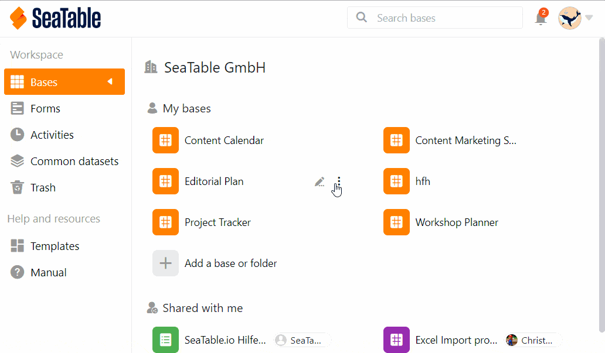
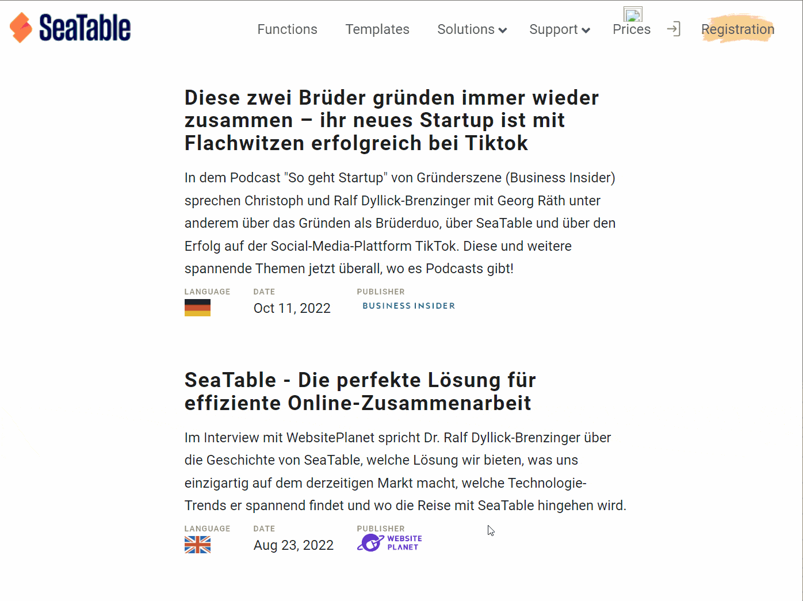

Sie haben Daten, die Sie mit einer größeren Anzahl an Personen teilen oder sogar öffentlich zugänglich machen wollen? Für diese Anwendungsfälle sind **externe Links** genau das Richtige!

Externe Links gewähren **Lesezugriff** auf die Daten in einer Base, **ohne** dass dazu eine **Anmeldung** in SeaTable erforderlich ist. Außerdem lassen sich externe Links **in Webseiten einbetten** und damit kleine und große Datensammlungen ganz einfach online bereitstellen.

Folglich bieten Ihnen externe Links jede Menge spannende Möglichkeiten. Dieser Beitrag erklärt Ihnen, welche das sind und wie Sie sie nutzen.

## Funktionsweise und Typen von externen Links

Ein externer Link ist eine **URL**, über die Sie mit **Lesezugriff** auf eine Datensammlung in SeaTable zugreifen können. Eine solche Datensammlung kann eine [Base]() oder eine [Ansicht]() sein.

- **Externer Link für eine Base**: Durch den Aufruf dieses externen Links kann der Besucher alle in einer Base gespeicherten Daten inklusive aller Tabellen **sehen**. Der Besucher kann darüber hinaus auf **alle bestehenden Ansichten** und [Statistiken]() zugreifen. Zudem kann er die **Auswertungswerkzeuge** [Gruppierung, Sortierung und Filter]() verwenden.
- **Externer Link für eine Ansicht**: Ein solcher externer Link gewährt **Lesezugriff auf _eine_ bestimmte Ansicht einer Tabelle**. Andere Ansichten und Tabellen in der Base sowie **ausgeblendete Zeilen und Spalten** bleiben vor den Nutzern des externen Links **verborgen**. Lesen Sie mehr darüber im Artikel [Externen Link für eine Ansicht erstellen]().

Externe Links sind grundsätzlich **öffentliche Links**, d.h. der Link kann von jeder Person aufgerufen werden, egal ob sie in SeaTable angemeldet ist oder nicht. Dies ist auch einer der wesentlichen [Unterschiede zum Einladungs-Link]().

Externe Links eignen sich immer dann, wenn Sie **externen Personen** Daten in Bases zugänglich machen wollen. Dies können Ergebnisse einer Umfrage sein, eine Preisliste genauso wie die Zeitplanung eines Events oder eines Produktreleases. Ein besonderer Einsatzzweck von externen Links ist deren **Einbettung in Webseiten**, zu der Sie unten mehr erfahren.

## So erstellen Sie einen externen Link für eine Base

1. Gehen Sie auf die **Startseite** von SeaTable.
2. Bewegen Sie den Mauszeiger auf die **Base**, die Sie teilen möchten, und klicken Sie auf die rechts erscheinenden **drei Punkte**.
3. Wählen Sie die Option **Freigeben** aus.
4. Klicken Sie auf **Externer Link**.
5. Stellen Sie ein, ob Sie **Lese- und Schreibrechte** oder nur **Leserechte** vergeben möchten.
6. Entscheiden Sie auch, ob Sie einen **Passwortschutz** und/oder ein **Ablaufdatum** haben möchten.
7. Wählen Sie aus, ob Sie eine **zufällige URL** generieren oder eine **eigene URL** festlegen möchten.
8. Klicken Sie auf **Erstellen**.

## Einbetten eines externen Links in eine Webseite

Externe Links eignen sich super, um einzelne Datensätze auf einer Webseite zu veröffentlichen. Die Besucher der Webseite sehen nur die Inhalte, die freigegeben wurden, können die Inhalte jedoch nicht verändern.

Mit einem einfachen _embed-Tag_ können Sie eine Base oder eine Ansicht über einen externen Link in eine Webseite integrieren. Die Bases in unserer [Template-Bibliothek]() sind beispielsweise mittels externer Links in unsere Webseite eingebettet. Auf diese Weise veröffentlichen wir auch die Presseartikel von SeaTable auf unserer Presseseite.

