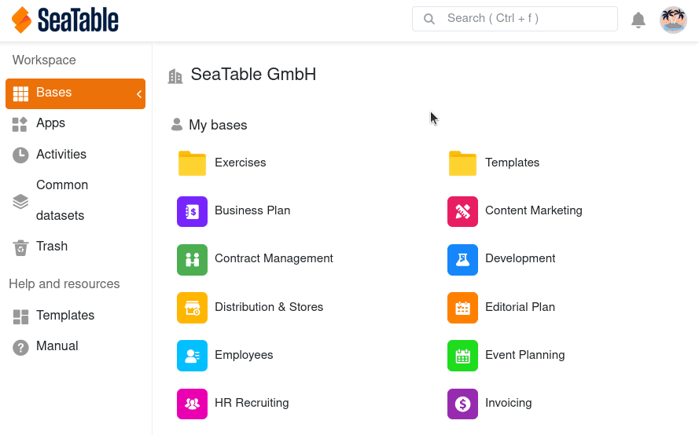
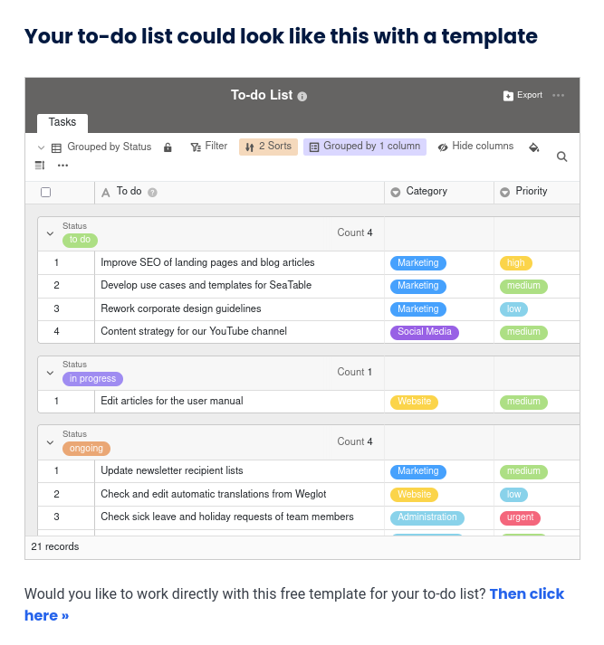

Do you have data that you want to share with a larger number of people or even make publicly available? For these use cases, **external links** are just the thing!

External links provide **read-only access to** the data in a base **without** the need to **log in** to SeaTable. In addition, external links can be **embedded in web pages**, making small and large data collections easily available online.

Consequently, external links offer you lots of exciting opportunities. This post explains what they are and how to use them.

## Functionality and types of external links

An external link is a **URL** that you can use to access a data collection in SeaTable with **read** access. Such a data collection can be a [base]() or a [view]().

- **External link for a base**: By calling this external link, the visitor can **see** all data stored in a base, including all tables. The visitor can also access **all existing views** and [statistics](). In addition, they can use the **evaluation tools** [grouping, sorting and filtering]().
- **External link for a view**: Such an external link grants **read access to _a_ specific view of a table**. Other views and tables in the base as well as **hidden rows and columns** remain **hidden** from the users of the external link. Read more about it in the article [Creating an external link for a view]().

External links are basically **public links**, i.e. the link can be accessed by anyone, regardless of whether they are logged into SeaTable or not. This is also one of the main [differences from the invitation link]().

External links are suitable whenever you want to make data in bases accessible to **external persons**. This could be the results of a survey, a price list, or the timing of an event or product release. A special use of external links is their **embedding in web pages**, which you can learn more about below.

## How to create an external link for a base

1. Go to the **home** page of SeaTable.
2. Move the mouse cursor to the **base** you want to share and click the **three dots** that appear on the right.
3. Select the **Share** option.
4. Click **External Link**.
5. Decide whether you want to add **password protection**, an **expiration date** and a **description** by activating the corresponding check boxes.
6. Select whether you want to generate a **random URL** or specify a **custom URL**.
7. Click **Create**.

Now you can **copy the link** and share it with as many people as you like.

## Embedding an external link in a web page

External links are great for publishing a certain number of records on a website. The visitors of the website see the content that has been shared, but they are not able to modify the content.

With a simple _embed tag_, you can integrate a base or view into a web page using an external link. For example, the [SeaTable templates]() are embedded in our website using external links.

