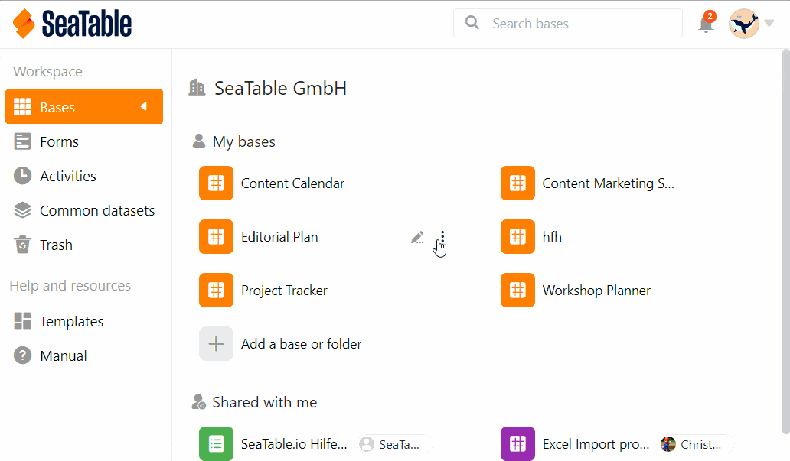

Vous avez des données que vous souhaitez partager avec un grand nombre de personnes ou même rendre publiques ? Pour ces cas d'application, les **liens externes** sont exactement ce qu'il vous faut !

Les liens externes permettent **d'accéder en lecture** aux données d'une base **sans** avoir à **se connecter** à SeaTable. De plus, les liens externes peuvent être **intégrés dans des pages web**, ce qui permet de mettre facilement en ligne des collections de données, petites ou grandes.

Par conséquent, les liens externes vous offrent de nombreuses possibilités intéressantes. Cet article vous explique quelles sont ces possibilités et comment les utiliser.

## Fonctionnement et types de liens externes

Un lien externe est une **URL** qui vous permet d'accéder **en lecture** à un recueil de données dans SeaTable. Un tel recueil de données peut être une [base]() ou une [vue]().

- **Lien externe pour une base**: En appelant ce lien externe, le visiteur peut **voir** toutes les données enregistrées dans une base, y compris tous les tableaux. Le visiteur peut en outre accéder à **toutes les vues** et [statistiques]() **existantes**. Il peut en outre utiliser les **outils d'évaluation** que sont le [regroupement, le tri et le filtre]().
- **Lien externe pour une vue**: un tel lien externe donne **un accès en lecture à _une_ vue spécifique d'un tableau**. Les autres vues et tableaux de la base, ainsi que **les lignes et colonnes masquées**, restent **cachés** aux utilisateurs du lien externe. Pour en savoir plus, consultez l'article [Créer un lien externe pour une vue]().

Les liens externes sont en principe des **liens publics**, c'est-à-dire que le lien peut être consulté par toute personne, qu'elle soit ou non connectée à SeaTable. C'est aussi l'une des principales [différences avec le lien d'invitation]().

Les liens externes sont toujours appropriés lorsque vous souhaitez rendre des données accessibles **à des personnes externes** dans les bases. Il peut s'agir des résultats d'une enquête, d'une liste de prix ou encore du calendrier d'un événement ou de la sortie d'un produit. Une utilisation particulière des liens externes est leur **intégration dans des pages web**, dont vous trouverez plus d'informations ci-dessous.

## Comment créer un lien externe pour une base

1. Allez sur la **page d'accueil** de SeaTable.
2. Déplacez le curseur de la souris sur la **base** que vous souhaitez diviser et cliquez sur les **trois points** qui apparaissent à droite.
3. Sélectionnez l'option **Partager**.
4. Cliquez sur **Lien externe**.
5. Définissez si vous souhaitez attribuer **des droits de lecture et d'écriture** ou uniquement **des droits de lecture**.
6. Décidez également si vous souhaitez une **protection par mot de passe** et/ou une **date d'expiration**.
7. Choisissez si vous souhaitez générer une **URL aléatoire** ou définir une **URL personnalisée**.
8. Cliquez sur **Créer**.

## Intégration d'un lien externe dans une page web

Les liens externes conviennent parfaitement à la publication d'enregistrements individuels sur un site web. Les visiteurs du site web ne voient que les contenus qui ont été partagés, mais ne peuvent pas les modifier.

Une simple _balise embed_ permet d'intégrer une base ou une vue dans une page web via un lien externe. Les bases de notre [bibliothèque de modèles](https://seatable.io/vorlagen/) sont par exemple intégrées dans notre site web au moyen de liens externes. C'est également de cette manière que nous publions les articles de presse de SeaTable sur notre page de presse.

