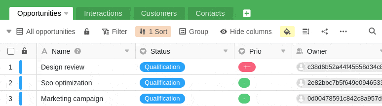



Um eine optimale Zusammenarbeit zu ermöglichen, können Sie Ansichten von Tabellen an Ihre Teammitglieder und andere Benutzer freigeben. Bei der Freigabe können Sie entscheiden, ob andere Benutzer die geteilte Ansicht lediglich lesen oder auch bearbeiten können.

Wenn Sie einem anderen Benutzer Bearbeitungsrechte an einer geteilten Ansicht gewähren, ist dieser dazu berechtigt, jegliche Einträge in der Ansicht zu ändern. Entsprechende Änderungen werden anschließend auch in Ihre Ansicht übernommen bzw. in die Ansicht aller Benutzer, denen Sie Ihre Ansicht freigegeben haben.

## Freigabe einer Ansicht an ein Teammitglied

1. Öffnen Sie die **Ansicht** einer Tabelle, die Sie freigeben möchten.
2. Klicken Sie auf **Ansicht teilen** und wählen Sie anschließend **Freigabe für Benutzer**.
3. Wählen Sie einen **Benutzer** aus, dem Sie die Ansicht freigeben möchten.
4. Entscheiden Sie im Feld **Berechtigung**, ob Ihr Teammitglied die Ansicht lediglich lesen oder auch bearbeiten kann.
5. **Benennen** Sie die Freigabe und bestätigen Sie diese mit **Abschicken**.

Haben Sie die Ansicht erfolgreich an einen anderen Benutzer freigegeben, erscheint diese auf dessen Startseite unter dem Reiter **Für mich freigegeben**:

Öffnet ein Benutzer eine mit ihm geteilte Ansicht, kann diese beispielsweise folgendermaßen aussehen:

## Auflösen einer geteilten Ansicht

Wenn Sie eine Tabellenansicht nicht mehr mit einem anderen Benutzer teilen wollen, können Sie die Freigabe problemlos wieder löschen:

1. Öffnen Sie die **Ansicht** einer Tabelle, die Sie an einen anderen Benutzer freigegeben haben.
2. Klicken Sie auf **Ansicht teilen**.
3. Wählen Sie unter **Freigabe für Benutzer** die gewünschte Freigabe aus und drücken Sie auf **Löschen**.

## Unterschied zwischen der Freigabe einer ganzen Base und der Freigabe einer Ansicht

In einer Base gibt es insgesamt zwei **Sharing-Icons**, mit denen Sie entweder eine gesamte Base oder eine einzelne Tabellenansicht freigeben können. Entsprechend ihrer Funktion finden Sie diese Icons entweder im Bereich **Base-Optionen** (hier farbig hinterlegt) oder im Bereich **Ansichts-Optionen** (hier weiß):

### Freigabe einer Base

- Die gesamte Base (inklusive aller **Tabellen**, **Ansichten** und **Daten**) wird an einen anderen Benutzer freigegeben.

### Freigabe einer Ansicht

- Lediglich die ausgewählte **Ansicht einer Tabelle** wird an einen anderen Benutzer freigegeben.

## Besonderheiten

Bei der Freigabe einer Ansicht gibt es einige Besonderheiten, die es zu beachten gilt:

- In einer Ansicht ausgeblendete Spalten werden den Betrachtern des Freigabe-Links **nicht** angezeigt.
- Enthält eine freigegebene Tabellenansicht Verknüpfungen zu den Einträgen einer anderen Tabelle, die Sie nicht an den jeweiligen Benutzer freigegeben haben, kann dieser dennoch die entsprechenden Einträge **sehen** und je nachdem, welche Rechte Sie ihm für die geteilte Ansicht gewährt haben, diese auch **bearbeiten**.
