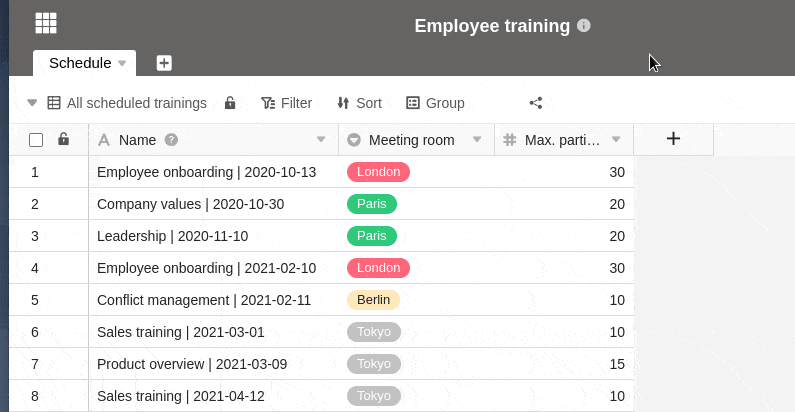
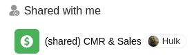



To enable optimal collaboration, you can share views of tables with your team members and other users. When sharing, you can decide whether other users can only read the shared view or also edit it.

If you grant editing rights to a shared view to another user, he is authorized to change any entries in the view. Corresponding changes are then also applied to your view or to the view of all users to whom you have shared your view.

## Sharing a view with a team member

1. Open the **view of** a table you want to share.
2. Click **Share View**, and then select **Share with User**.
3. Select a **user** to whom you want to share the view.
4. In the **Permission** field, decide whether your team member can only read the view or also edit it.
5. **Name the** share and confirm it with **Submit**.

If you have successfully shared the view with another user, it will appear on their home page under the **Shared with me** tab:

For example, if a user opens a view shared with them, it may look like this:

## Resolve a split view

If you no longer want to share a table view with another user, you can easily delete the share:

1. Open the **view of** a table that you have shared with another user.
2. Click **Share View**.
3. Under **Share with user**, select the desired share and press **Delete.**

## Difference between sharing a whole base and sharing a view

In a base, there are a total of two **sharing icons** that you can use to share either an entire base or a single table view. According to their function, you will find these icons either in the **base Options** area (highlighted here) or in the **View Options** area (white here):

### Share a base

- The entire base (including all **tables**, **views** and **data**) is shared with another user.

### Share a view

- Only the selected **view of a table** is shared with another user.

## Special features

When sharing a view, there are some special features that need to be considered:

- Columns hidden in a view are **not** displayed to viewers of the share link.
- If a shared table view contains links to the entries of another table that you have not shared with the respective user, the user can still **see** the corresponding entries and, depending on the rights you have granted him for the shared view, also **edit** them.
